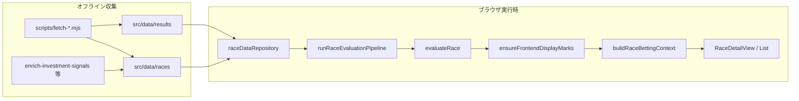

# 実装ロジック詳細一覧

本ドキュメントは、リポジトリ **競馬最強予想ファイルの改善版** に **現時点で実装済み** のロジックを、コードベースに基づいて網羅的にまとめたものです。  
（2026年5月時点の `src/`・`scripts/`・`python/` を対象。2026-05-22 に投資キャップの運用切替と脚質分散デフォルトを反映。**2026-05-24** にレース詳細UI整理・当週TOP5・BT競馬場×距離傾向・オッズ運用メモを追記）

---

## 0. 実装機能一覧（2026-05 時点）

実装済み機能を **ユーザー向け機能** と **内部ロジック** に分けて一覧化します。詳細は各章を参照してください。

### 0.1 ユーザー向け機能（UI）

| 機能 | 画面・入口 | 実装の要点 |
|------|-----------|------------|
| レース一覧 | `/races` | 日付タブ → 競馬場タブ → レースカード（最大12R/場）。凡例（的中/不的中/未確定） |
| 直近30R 印的中率 | 一覧ヒーロー | ◎○▲ の複勝圏（3着以内）率。全日程・全場混在のグローバル順 |
| 直近30R 馬券回収率 | 一覧ヒーロー | **EV推奨券のみ**。`computeRaceBettingOutcomeById`（AIパイプライン連動・投資0Rは集計除外） |
| 全日・全場 結果一括取得 | 一覧ボタン | `ensureRaceResultFetched` を全日程ループ |
| レース詳細・出馬表 | `/race/:id` 初期タブ `horses` | 印順ソート、馬一覧、能力カード展開、脚質サマリー |
| レース詳細・買い目 | タブ `bets` | **EV推奨券ダッシュボード**（0点時は見送りバナーのみ）、コピー |
| レース詳細・結果 | タブ `result` | 着順・**EV券**払戻内訳のみ（**買い目ダッシュボードは非表示**）。見送り時「投資0/払戻0/回収0%」 |
| 条件スライダー | 詳細アコーディオン | 馬場・ペース・バイアス・ゲート指定・ラップタイプ。即時再評価 |
| 条件 localStorage 引き継ぎ | 同日同場同芝 | `date:venue:surface` キーで保存 |
| 能力のみプレビュー | チェックボックス | 中立条件でスコアのみ再計算（印は別ロジック） |
| **Python AI 固定** | 詳細（内部） | `DEFAULT_PROBABILITY_ENGINE=ai`。**UIの TS/AI 切替・`?engine=ts` は廃止**（2026-05-24） |
| **方針B: AI印** | 常時 | `ai_effective_ev` 降順で ◎○▲☆△△△（7頭）。TS印は破棄 |
| **NO_EV 見送りレジーム** | 常時 | 全頭EV横並び → 警告バナー＋相対印表示・**EV推奨0点**（§5.4） |
| **レースナビ（固定）** | 詳細・**ヘッダ上** | `RaceTopNav`: 開催日・競馬場・R番号＋前後R。**sticky**（`race-nav--top`） |
| **当週の期待値レース TOP5** | 一覧ヒーロー | `fetchWeeklyTopEvRaces`（§3.4）。◎の `ai_effective_ev` 降順・結果確定済みは除外 |
| netkeiba リンク | 詳細ヘッダー | 出馬表・結果ページへのリンク |
| 回収率バックテスト画面 | `/backtest` | **EV推奨券**集計サマリ + TS/AI比較 + 結果確定全R一覧 + **競馬場×距離傾向**（§7.5） |
| ダークテーマ | ナビ | `localStorage` でテーマ切替 |
| テーマ・ナビ | `App.tsx` | レース一覧 / バックテストへのルーティング |

### 0.2 評価・予想ロジック（TypeScript ドメイン）

| 機能 | モジュール | 要点 |
|------|------------|------|
| 5軸能力評価 `evaluateRace` | `scoreCalculator.ts` | 能力主軸・相対スコア・消し・買いラベル・コメント生成 |
| TS 表示用印 | `ensureFrontendDisplayMarks.ts` | ◎○▲☆△ 必須埋め + 追加△ + ☆候補 |
| TS 印ロール・4角昇格 | `markAssigner.ts` | 補欠け役割、先行◎昇格等 |
| Softmax 勝率 | `normalization.ts` | T=1.5 固定 |
| 評価パイプライン | `evaluationPipeline.ts` | evaluate → 印 → 勝率 → ViewModel |
| **AI 勝率** | `probabilityEngine.ts` | JSON `ai_predicted_win_rate`（レース内正規化済み） |
| **AI 実質EV** | バックフィル JSON | `(ai_predicted_win_rate × オッズ) - 0.15` |
| **AI 印再割当（方針B）** | `aiMarkAssignment.ts` | EV降順 → 同率時は勝率→`finalEvaluationScore` |
| **EVレジーム判定（案A）** | `aiEvRegime.ts` | `NO_EV_REGIME` でEV推奨を抑制・印は相対表示 |
| ViewModel | `raceEvaluationViewModel.ts` | レーダー・勝率・EV表示・Kelly・evHot |
| 印的中判定 | `markHitAnalysis.ts` | 3着以内との突合 |
| レースプレビュー | `racePreview.ts` | 人気とシステム順位のギャップ |
| コース/会場/血統ボーナス | 各 `*.ts` | 20+ サブモジュール（§4.7） |

### 0.3 馬券・回収ロジック

| 機能 | モジュール | 要点 |
|------|------------|------|
| **EV推奨券（正）** | `generateBetTicketsFromEvaluation` | UI・BT・一覧の**唯一の購入ソース**。◎軸＋券種別EV閾値＋点数キャップ |
| 定型フォーメ（参考） | `generateFormationBetTickets` | **集計・UIから撤去**。内部診断（G1レポート等）のみ残存 |
| 払戻計算 | `payoutCalculator.ts` | 確定配当優先。複勝券は `fallbackExoticOdds` で推定払戻可 |
| 見送り理由 | `resolveBettingAdvisoryReason` | `no_ai_ev_regime` / `no_marks` / `contradictory_marks` / `no_ev_recommendation` |
| 馬券コンテキスト | `buildRaceBettingContext` | `evTickets` のみ。`buildRaceBettingContextFromPipeline` で印・エンジン整合 |
| 一覧 outcome | `computeRaceBettingOutcomeById` | フルパイプライン + EV券払戻。投資0は `mergeListBettingRecoveryStats` 除外 |
| バックテスト1R | `runBacktest.ts` | `evTickets` のみ `calculateRacePayout` |
| バックテスト集計 | `runFullBacktest.ts` | フラット `BacktestSummary`（`evSummary`/`formationSummary` 廃止） |
| **TS vs AI 比較BT** | `runTsVsAiBacktestComparison` | 同一 AIバックフィル済み集合で TS印 vs AI印 |
| **的中レース一覧** | `collectRaceDetailsForHitList` | 結果JSON全件。カード色: 的中 / **見送り(EV0点)** / 不的中 |

### 0.4 データ・オフライン（Node `scripts/`）

| 機能 | npm script / ファイル | 要点 |
|------|----------------------|------|
| netkeiba 出馬表取得 | `fetch-races-from-netkeiba.mjs` | races + index、過去走・能力推定 |
| 結果・配当取得 | `fetch-results` | `results/*.json` |
| 直前オッズ | `fetch-live-odds` | `market_win_odds` / `actual`（**長時間ハング時は CSV 適用のみで可**・§9.2） |
| **オッズ一括（推奨）** | `refresh-latest-odds.mjs` | JRA CSV 生成 →（任意）live-fetch → `apply-external-odds` |
| 投資シグナル enrich | `enrich-investment-signals` | `final_expected_value`, value rank |
| **AI バックフィル** | `backfill-ai-predictions.py` | 全 races に `ai_*` 追記 |
| 日次ベースライン | `build-daily-baseline` | バイアスマスタ等 |
| 父馬統計 | `build-sire-stats` | 血統ボーナス用 |
| 能力再推定 | `reestimate-abilities` | 過去走から5軸 |
| 評価JSON再計算 | `recompute-race-evaluations.ts` | オフライン `evaluation` ブロック |

### 0.5 Python ML（別実行系）

| 機能 | CLI | 要点 |
|------|-----|------|
| DB収集（全年） | `main.py collect` | netkeiba → SQLite |
| 限定収集 | `collect-quick` | フロント results + golden |
| 学習 | `main.py train` | LightGBM + EV重み付け2パス |
| シミュレーション | `main.py simulate` | 単勝EVスイープ |
| 1レース推論 | `predict --race-id` | BettingEvaluator連携 |
| Feature Bridge | `feature_bridge.py` | DB優先 / TS JSON |

### 0.6 明示的に未実装・部分実装

| 項目 | 状態 |
|------|------|
| フロント実行時の Python 呼び出し | **未実装**（JSONバックフィル前提） |
| 一覧30R回収率 | **AIパイプライン**（`DEFAULT_PROBABILITY_ENGINE`）。`ai_*` 欠損レースは TS フォールバック |
| Python simulate とフロント券種 | **単勝のみ vs WIN/REN/WREN/TRI**（別系統） |
| 案B（ML特徴量に前走上がり等） | **未実装**（中期計画） |
| レース詳細の TS 切替 UI | **廃止**（2026-05-24）。パイプライン内部の TS フォールバック（`ai_*` 欠損時）のみ残存 |
| レース詳細「前走加点」クイックボタン | **廃止**（条件パネル側の `lastRunReset` はデータ上残存可） |
| レース詳細サイドバー「レース視点サマリー」 | **廃止**（`RaceEvaluationSummary` は未マウント。ファイルは残置） |

### 0.7 既知の制約・データ品質（2026-05-24 時点）

| 現象 | 影響 | 対処・備考 |
|------|------|------------|
| **当週TOP5 / `ai_effective_ev` ランキング** | EV S 帯でも ◎ が **10番人気以下・100倍級** になりうる | EV は「勝つ確率」ではなく **(勝率×オッズ)−マージン**。大穴は EV だけ突出しやすい |
| **AI バックフィル後の勝率偏り** | 一部レースで **1頭のみ `ai_predicted_win_rate>0`、他馬 0%**（京都などで観測） | `ai_effective_ev`・TOP5 が過大評価。**`python main.py diagnose-calibration` / バックフィル見直し**を推奨。勝率が3頭以上分散しているレースを運用優先 |
| **`refresh-latest-odds` + `--live-fallback`** | `fetch-live-odds`（Playwright）が **長時間停止** することがある | JRA CSV 生成後に **`node scripts/apply-external-odds.mjs --csv=data/latest-odds.csv`** で適用可。続けて **`backfill-ai-predictions.py`** |
| オッズ未更新日 | `market_win_odds_source=estimated` のまま | 対象日で `refresh-latest-odds` → `apply-external-odds` → `backfill` の順 |

---

## 目次

0. [実装機能一覧（2026-05 時点）](#0-実装機能一覧2026-05-時点)
1. [システム概要](#1-システム概要)
2. [データ層](#2-データ層)
3. [アプリケーション構成（React）](#3-アプリケーション構成react)
4. [レース評価ドメイン](#4-レース評価ドメイン)
5. [評価パイプラインと ViewModel](#5-評価パイプラインと-viewmodel)
6. [馬券・回収ドメイン](#6-馬券回収ドメイン)
7. [バックテスト](#7-バックテスト)
8. [UIコンポーネントの責務](#8-uiコンポーネントの責務)
9. [オフラインスクリプト（Node）](#9-オフラインスクリプトnode)
10. [Python ML パイプライン](#10-python-ml-パイプライン)
11. [定数・閾値早見表](#11-定数閾値早見表)
12. [テストと品質保証](#12-テストと品質保証)
13. [関連ドキュメント](#13-関連ドキュメント)

---

## 1. システム概要

### 1.1 二系統のアーキテクチャ

本プロジェクトは **実行時に統合されていない二系統** で構成されています。

| 系統 | 技術 | 役割 | データ源 |
|------|------|------|----------|
| **フロント（本番 UI）** | React + TypeScript + Vite | レース評価・印・馬券推奨・バックテスト表示 | 静的 JSON（`src/data/`） |
| **Python ML** | LightGBM + SQLite | netkeiba DB 収集・学習・単勝 EV シミュレーション | `python/data/db/keiba.db` |

緩い結合として、`src/data/results/*.json` の race_id が Python `collect-quick` の収集種になります。

**Phase 1 + 方針B + 案A（2026-05）:**

| 層 | 内容 |
|----|------|
| オフライン | `backfill-ai-predictions.py` → JSON に `ai_predicted_win_rate` / `ai_effective_ev` |
| 実行時 | フロントは **Python を呼ばない**。上記 JSON を読むのみ |
| 方針B | AIモード時、表示印は **`ai_effective_ev` 降順の機械割当**（TS印は使わない） |
| 案A | 全頭EV横並び **または勝率分布が横並び** のレースは **相対印は付与**・**EV推奨0点**＋警告バナー |
| 馬券集計 | **EV推奨券のみ**（定型フォーメ・`(印)` 参考払戻の二重計上は廃止） |
| 参考表示 | `finalEvaluationScore`・能力・条件スライダーは **常に TS 系**（`evaluateRace`） |
| 非上書き | `predicted_win_rate` / `final_expected_value`（enrich由来）はバックフィルで触らない |

### 1.2 エンドツーエンド（フロント）



---

## 2. データ層

### 2.1 ファイル配置

| パス | 内容 |
|------|------|
| `src/data/index.json` | レース一覧（`raceId`, `date`, `venue`, `raceNumber`, `raceName`, `surface`, `distance`, `raceGrade?`） |
| `src/data/races/{raceId}.json` | 出馬表・能力値・条件・過去走・投資シグナル・事前計算 `evaluation` |
| `src/data/results/{raceId}.json` | 着順 `places[]`、確定配当 `payouts`（WIN/REN/WREN/TRI） |
| `src/data/backtest_summary.json` | AI印バックテスト集計（`npm run backtest:bets`） |
| `src/data/backtest_comparison.json` | 同一96Rでの TS vs AI 回収率比較 |
| `src/data/backtest_summary_ts.json` | TSのみ参考サマリ（`npm run backtest:ts`） |

**raceId 形式:** netkeiba 12 桁（例: `202604010601` = 2026/04/01 中山 1R）

### 2.2 レース JSON の主要フィールド

- **`raceInfo`**: 日付・場・距離・芝/ダ・クラス名・グレード等
- **`condition`**: `RaceCondition` 相当（馬場・ペース・バイアス・`raceAnalysis`・会議フェーズ等）
- **`entries[]`**: 各馬の `abilities`（5軸）、`pastRuns`、`signals` / `investment`、`pedigree`、`horseNumber`（馬番）
- **`evaluation`**（任意）: オフライン `recompute-race-evaluations.ts` で書き込まれた評価ブロック
- **Phase1 Python ML（`entries[]` 任意）**:
  - `ai_predicted_win_rate` — Isotonic キャリブレーション後、レース内で合計1に正規化
- `ai_effective_ev` — `(ai_predicted_win_rate × min(単勝オッズ, 100.0)) − 0.15`
  - `market_win_odds` / `market_win_odds_source`（`actual` \| `estimated` \| 欠損）— バックフィル時のオッズ源
  - TS enrich の `predicted_win_rate` / `final_expected_value` とは **別フィールド**（上書きしない）
- **データ読み込み:** `raceDataToHorses.ts` → `HorseAbility.aiPredictedWinRate` / `aiEffectiveEv`
- **オッズ補完（2026-05-20）:** UI形式JSONで `evaluationSignals` が欠けていても、`convertToRaceEvaluationData` の `enrichEntryEvaluationSignals` が `market_win_odds` / `estimated_actual_odds` を `evaluationSignals.winOdds` に反映（5/10・5/17 の全見送りバグ対策）

### 2.3 結果 JSON

```typescript
places: { place, horseId?, horseName?, horseNumber?, corners?, margin? }[]
payouts?: {
  WIN?: { numbers: number[], dividend: number }[]
  REN?: ...   // 馬連（MAIN_LINE 照合）
  WREN?: ...  // ワイド
  TRI?: ...   // 3連複
}
```

配当は **100円あたり** の金額。`payoutCalculator` が組み合わせキー（馬番ソート済み `1-3-5`）で検索。

### 2.4 キャッシュ（開発時）

- `raceDataRepository`: 開発モードで JSON をキャッシュバスト取得
- 結果: `localStorage` キー `race-result-cache:{raceId}` + メモリキャッシュ
- `ensureRaceResultFetched`: 結果未取得時に API/スクリプト経由で取得

---

## 3. アプリケーション構成（React）

### 3.1 エントリ

- `src/main.tsx`: `ReactDOM.createRoot` + `BrowserRouter`
- `src/App.tsx`: ナビ・テーマ（`localStorage`）・ルート

### 3.2 ルーティング

| パス | ページ | 主な処理 |
|------|--------|----------|
| `/` | リダイレクト | → `/races` |
| `/races` | `RacesListPage` | 日付→場→`RaceListCard`、印的中率・回収率（直近30レース） |
| `/race/:raceId` | `RaceDetailPage` | `getRaceEvaluationById`、dev時4秒ポーリング、**AI固定**（`DEFAULT_PROBABILITY_ENGINE`） |
| `/backtest` | `BacktestDashboardPage` | EV集計サマリ + TS/AI比較 + 結果確定全R一覧 + 競馬場×距離傾向 |

### 3.3 勝率エンジン（Python AI 固定・2026-05-24）

レース詳細（`RaceDetailView`）は **常に Python AI**（`requestedEngine = DEFAULT_PROBABILITY_ENGINE`）。初期タブは **出馬表**。

- **UIからの TS 切替・`useSearchParams('engine')` は削除**（2026-05-24）。
- `ai_*` が全頭揃わないレースのみ、パイプライン内部で **TS 勝率にフォールバック**（`resolveAdjustedProbabilities`）。印・EV推奨の主系は AI 前提。

#### 表示モード比較表（ユーザー向け）

| モード | 勝率表示 | 期待値（カード） | 単勝EV閾値 | 印の付け方 | 購入券（UI/BT） | スコア・能力表示 |
|--------|----------|----------------|------------|------------|--------------|------------------|
| **AI・NORMAL** | `ai_predicted_win_rate` | `ai_effective_ev` | **1.30** | **EV降順で◎○▲☆△△△** | **EV推奨券**（◎軸） | TS `evaluateRace`（参考） |
| **AI・NO_EV** | 同上 | 同上 | 推奨なし | **EV相対印◎〜△** | **0点・見送り表示** | 警告バナー |
| **TS（内部フォールバックのみ）** | Softmax(score, T=1.5) | `final_expected_value` | 1.3 | `ensureFrontendDisplayMarks` | EV推奨券（TS閾値） | TS再計算 |

#### 処理フロー（`runRaceEvaluationPipeline`）

```text
1. raw = evaluateRace(horses, condition)           # 常にTSスコア
2. tsMarked = ensureFrontendDisplayMarks(raw)      # TS印（内部保持）
3. resolveAdjustedProbabilities → probabilityEngine  # ai or ts（欠損時ts）
4. aiRaceRegime = resolveAiRaceRegime(horses)       # ai時のみ
5. 印:
   - ai            → applyAiMarksByEffectiveEv(tsMarked)  # NO_EV でも相対印
   - ts            → tsMarked
   - ai かつ ◎欠落 → applyAiMarksByEffectiveEv を再実行（ガード）
6. isSkippableRace = (ts時のみ) math1位 ≠ ◎  # AI時は常に false
7. viewModel = buildRaceEvaluationViewModel(...)

### 3.4 当週の期待値レース TOP5（一覧）

**モジュール:** `src/domain/race-evaluation/weeklyTopEvRaces.ts`  
**UI:** `RacesListPage` ヒーロー内 `fetchWeeklyTopEvRaces`（既定 `topN=5`）

| 処理 | 内容 |
|------|------|
| 対象レース | `filterUnconfirmedUpcomingRaces` … カレンダー週内かつ `date >= today`、**結果確定済み（着順3頭以上）を除外** |
| レース指標 | 各レースの **Python AI ◎** = `pickAiFavoriteEntryFromEvaluation`（`ai_effective_ev` 最大頭） |
| 並び | `maxEv` 降順 → 日付 → R番 |
| 表示 | 日付・場・R・レース名・◎（番・名・騎手・オッズ）・EV・value rank（S/A/B/C/D） |

**注意:** `maxEv` は **「そのレースで最も EV が高い1頭」** の値。複数レース横断の「来やすさ」ランキングではない（§0.7）。勝率が1頭に100%集中しているレースはランキングを過大評価しうる。
8. buildRaceBettingContext(results, ..., { probabilityEngine, noAiEvRegime })
   → evTickets のみ（engine 未指定時は ai_* 全頭あれば自動 "ai"）
```

#### 実装ファイル

| ファイル | 役割 |
|----------|------|
| `probabilityEngine.ts` | `parseProbabilityEngine`, `resolveAdjustedProbabilities`, `raceHasFullAiBackfill` |
| `aiMarkAssignment.ts` | `AI_MARK_SLOTS`, `applyAiMarksByEffectiveEv`, 印順ソート |
| `aiEvRegime.ts` | `resolveAiRaceRegime`, `NO_EV_REGIME_BANNER_TEXT` |
| `evaluationPipeline.ts` | 上記を統合した唯一の実行入口（UI・一覧outcome） |

#### フォールバック条件

| 条件 | 挙動 |
|------|------|
| 1頭でも `ai_*` 欠損 | `probabilityEngine` → `ts`、TS印 |
| `NO_EV_REGIME` | 警告バナー・EV推奨0点・相対印は表示（購入券なし） |
| ユーザーが TS ボタン | 常に TS モード |

#### `ai_effective_ev` の意味（再掲）

```text
ai_effective_ev = (ai_predicted_win_rate × min(単勝オッズ, 100.0)) − 0.15
```

- オッズ 0 / 欠損 → **−0.15（床）**（例: オークスで全頭が床に張り付く）
- **1.30 以上** → 単勝EV推奨候補（`AI_EFFECTIVE_EV_THRESHOLD`）
- 印の順位付けには閾値を使わず、**EVの大小順**のみ（方針B）

**連携:** 一覧30R回収率・レース詳細・バックテストはいずれも `evTickets` / `buildRaceBettingContextFromPipeline` で **同一エンジン・同一印** を使用。

### 3.4 レース一覧の集計ロジック

`src/app/races/page.tsx`:

1. `getRaceIndex()` で日付降順タブ
2. 表示レースごとにバックグラウンドで `ensureRaceResultFetched`
3. **印的中率（直近30）**: `evaluateRace` → `ensureFrontendDisplayMarks` → `analyzeMarkHits`（◎○▲が3着以内に含まれるか）
4. **回収率（直近30）**: `computeRaceBettingOutcomeById` → フルAIパイプライン → **EV券**払戻 → `mergeListBettingRecoveryStats`（**投資0Rは分母除外**）
5. **プレビュー**: `buildRacePreviewDataFromRace`（人気とAI順位のギャップ）

---

## 4. レース評価ドメイン

ディレクトリ: `src/domain/race-evaluation/`

### 4.1 型モデル（`abilityTypes.ts`）

#### 能力5軸

`speed`, `stamina`, `kick`, `sustain`, `power`（0〜100 想定）

#### 走法

`逃げ` | `先行` | `好位` | `差し` | `追込`（デフォルト `好位`）

#### 重み

`WeightSet`: 5軸の重み。`MIN_WEIGHT=0.05`, `MAX_WEIGHT=0.45`

#### 馬ごとのシグナル（`HorseEvaluationSignals`）

- `winOdds`, 直近大敗回数、2桁着順回数、好走回数
- `reproducibility01`, `gradedRaceTier`
- 騎手・調教師のコース勝率/複勝率
- 気性リスク `temperamentConcern01`

#### 投資ブロック（`InvestmentCommentInput`）

- `finalExpectedValue`（enrich 保存・**表示の単一ソース**）
- `valueRank` S/A/B/C/D、`betType`、`kellyWeight` 等

### 4.2 評価の中心: `evaluateRace`（`scoreCalculator.ts`）

**設計原則:**

- **能力値主軸**: レース内相対スコアを主軸に、適性ボーナスによる逆転幅を制限
- **印は評価内で付けない**: `evaluateRace` 終了時点では印未割当（コメント L701 付近）。印は `ensureFrontendDisplayMarks` で後段処理

#### 処理フロー（概要）

```
1. 馬データ前処理
   - abilitiesPrecomputedFromPastRuns でなければ blendAbilityWithPastRuns + applyKickL2Emphasis

2. レース文脈
   - resolveEffectiveRacePace, inferPaceSeverityKind
   - estimateFourthCornerRanking（4角位置予測）
   - pace/kick マップ構築

3. 第1パス（各馬）
   - calcHorseScore（重み付き5軸）
   - intrinsic: baseAbilityCore + reproducibilityDelta - riskPenalty + enginePeak + クラス/穴馬トリガー
     → compressIntrinsicTailScore
   - raceAdjustedInput: intrinsic + conditionScore + maxPerformance + 各種ボーナス
   - ラップ適合、RPCペナルティ、分散、役割ヒント

4. フィールド相対化
   - computeRaceRelativeScores(raceAdjustedInput)
     z-score → 50±12σ を 35〜85 にクリップ
     分散が極小のとき min-max フォールバック

5. 第2パス（各馬）
   - ペース適合ボーナス（◎+5, ○+2, ×-5, 極端×-10）
   - contextualBonuses（血統・枠・騎手・トリップ等、スタック上限あり）
   - combineFinalEvaluationScore
     final = raceRelative + clamp(finalRaw - raceRelative, ±MAX_APTITUDE_SWING)
     MAX_APTITUDE_SWING_FINAL = 8.0, BASELINE = 6.0

6. ランク付け
   - baseRank, adjustedRank, finalRank（各スコアでソート）

7. 事後処理
   - detectOddsDistortion（割安フラグ）
   - collectDismissIds → assignBuyLabels（消し・買いラベル）
   - generateScoreReason, predictionShortComments
```

#### 重要な上限定数（`scoreCalculator.ts`）

| 定数 | 値 | 意味 |
|------|-----|------|
| `MAX_COURSE_TRAIT_TOTAL` | 8.5 | コース特性ボーナス合計上限 |
| `COURSE_TRAIT_PLUS_RESILIENCE_CAP` | 12.0 | コース特性+耐性の合算上限 |
| `LAP_STACK_TOTAL_CAP` | 16.8 | ラップ系ボーナス合計上限 |
| `MAX_APTITUDE_SWING_FINAL` | 8.0 | 最終評価の適性起因スイング上限 |
| `BIAS_DISADVANTAGE_RECOVERY_BONUS` | 7.0 | 前走バイアス逆行の巻き返し補正 |

### 4.3 基礎能力スコア（`abilityCoreScoring.ts`）

```text
baseAbilityCore = mean(5軸) × 0.75 + top2平均 × 0.25
```

**過去走エンジン信号（`pastRunToEngineSignal`）:**

- 着差あり: `100 - marginSec × 30`（0〜100）
- 着順のみ: `100 - (place-1) × 8`

**ピーク合成:** 上位2走 `top1×0.7 + top2×0.3`（1走のみは ×0.65）

### 4.4 重み解決（`weightResolver.ts`, `courseWeights.ts`, `strategicWeights.ts`）

1. コースキー（場・芝ダ・距離）から `getBaseWeights`
2. 馬場・トラック速度・バイアス・ペース・`adjustmentStrength` で乗算調整
3. 会場物理要因（`venuePhysicalFactors.ts`）
4. バイアスマスタ（`biasMasterLookup.ts`）の傾き
5. 馬ごと: ペース厳しさ増幅、枠番ゲート比率（`FRAME_GATE_WEIGHT_RATIO`）

`calcHorseScore(horse, weights)` = Σ(能力値 × 重み) / Σ重み

### 4.5 レース内相対スコア（`finalScoring.ts`）

- 通常: z-score → `50 + z×12`、35〜85
- `combineFinalEvaluationScore`: `raceRelativeScore` と raw のブレンド（`ABILITY_RELATIVE_BLEND`）

**ペース適合ボーナス:**

| トークン | 加点 |
|----------|------|
| PERFECT | +5 |
| FIT | +2 |
| MAYBE | 0 |
| BAD | -5 |
| 極端BAD（前残り×スロー×追込等） | -10 |

### 4.6 消しルール（`dismissalRules.ts`）

4条件のうち **2件以上** で消し候補:

1. `finalRank > fieldSize - 2`（後方）
2. 適性 `fitLevel === LO`
3. ペース適合 `BAD`
4. `scoreDiff <= -1.0`

`venueRepeaterDismissRescue` で1件救済可能。

### 4.7 その他の評価モジュール（実装済み）

| モジュール | 役割 |
|------------|------|
| `paceFit.ts` | 走法×レースペース → PERFECT/FIT/BAD、消耗戦スタミナ耐性 |
| `lapShapeFit.ts` | 過去ラップ形状 vs 当日、RPC ペースミスマッチペナルティ |
| `distanceFit.ts` | 距離適性ボーナス |
| `classLevelScore.ts` | クラスレベルボーナス |
| `contextualBonuses.ts` | 血統・枠×バイアス・騎手・コネクション・トリップ |
| `structuralPhysicalBonuses.ts` | 体格・枠の構造ボーナス |
| `storedRaceAnalysisBonus.ts` | JSON `raceAnalysis` 由来ボーナス |
| `oddsDistortion.ts` | オッズと能力の乖離検出 |
| `longshotReversal.ts` | 穴馬巻き返し intrinsic ブースト |
| `classTriggerMultipliers.ts` | クラス別 intrinsic 倍率 |
| `estimatedFourthCorner.ts` | 4角順位予測・先行有利補正 |
| `markAssigner.ts` | 印ロール（△1安定等）、三角印数 |
| `resolveEffectiveRaceClass.ts` | `ClassTier`（MAIDEN_NEW … GRADED_OPEN） |
| `racePreview.ts` | `gap = expectedPopularity - systemRank` |
| `markHitAnalysis.ts` | 印的中判定（3着以内） |
| `buyLabel.ts` | 買いラベル（軸・相手・見送り等） |
| `reasonGenerator.ts` | スコア理由テキスト |
| `valueRankFromEffectiveEv.ts` | EV→S/A/B/C/D ランク（10/8/3/1 閾値） |

### 4.8 表示用印（`ensureFrontendDisplayMarks.ts`）

`evaluateRace` の結果をコピーし:

1. `assignHokkakeRoles`（補欠け役割）
2. `fillAllRequiredMarksForDisplay` — ◎○▲☆△ を **必ず** 1頭ずつ（DISMISS 馬も含む全頭から）
3. `ensureTriangleMarks` — 追加の △ 印
4. ☆は `finalRank>=6` かつ `baseRank-finalRank>=3` かつ `scoreDiff>=0.5` を優先

`markAssigner.applyCornerLeadFavoritePromotion`: 能力1位が4角10番手以下予測なら、能力上位の先行馬を ◎ に昇格可能。

---

## 5. 評価パイプラインと ViewModel

### 5.1 `runRaceEvaluationPipeline`（`evaluationPipeline.ts`）

**戻り値（`EvaluationPipelineResult`）:**

| フィールド | 説明 |
|------------|------|
| `results` | 画面・馬券に使う印付き結果（AI/NO_EV/TSで内容が変わる） |
| `tsReferenceResults` | 常に TS 印付き（内部参照・比較用） |
| `aiRaceRegime` | `NORMAL_AI_REGIME` \| `NO_EV_REGIME`（TS時は常に NORMAL） |
| `probabilityEngine` | 実際に使った `'ai'` \| `'ts'` |
| `adjustedProbabilities` | 勝率 Map（AI or Softmax） |
| `isSkippableRace` | TS時のみ: 数学1位≠◎ → EV券スキップ |
| `viewModel` | UI バインド用 |

**既定エンジン:** `DEFAULT_PROBABILITY_ENGINE = 'ai'`（`probabilityEngine.ts`）。

**呼び出し元:** `RaceDetailView`, `computeRaceBettingOutcomeById`, `runBacktest`（`probabilityEngine` オプション経由）。

### 5.2 Softmax（`normalization.ts`）

```text
P_i = exp((score_i - maxScore) / T) / Σ exp(...)
T = 1.5 固定（effectiveSoftmaxTemperature は常に 1.5 を返す）
```

分母≈0 のとき一様分布。

### 5.3 ViewModel（`raceEvaluationViewModel.ts`）

- レーダーチャート用の正規化加重能力
- 勝率: `probabilityEngine === 'ai'` なら `horse.aiPredictedWinRate`、それ以外は Softmax
- 期待値: AI モードは `horse.aiEffectiveEv`、TS モードは **`finalExpectedValue` を JSON のみ参照**（フロントで再計算しない）
- Kelly 表示、`evHot` if EV > 1.2（`FINAL_EXPECTED_RECOMMEND_THRESHOLD`）
- オッズ歪みによる確率ブーストは **削除済み**
- ViewModel ルートに `probabilityEngine` を保持（UI 表示用）

### 5.4 AI EV レジーム（案A・`aiEvRegime.ts`）

オークス型など「全頭が理論上マイナスEVで横並び」のレースで、**EV順に印を付けると誤解を招く**問題への対策。

#### 判定式

```text
候補EV = 全馬の ai_effective_ev を降順に並べ上位7頭
候補P  = 候補EVと同じ7頭の ai_predicted_win_rate
maxEv = 全馬の最大 ai_effective_ev
stdevEv = 候補EVの標準偏差
stdevP  = 候補Pの標準偏差

NO_EV_REGIME ⇔ (stdevP < WIN_RATE_STDEV_THRESHOLD (0.005))
            OR (maxEv < EV_WORTHLESS_THRESHOLD (−0.10)
                AND stdevEv < EV_STDEV_THRESHOLD (0.01))
```

| 定数 | 値 | 意味 |
|------|-----|------|
| `AI_EV_FLOOR` | −0.15 | 勝率0%時の理論床（= −PYTHON_EV_MARGIN） |
| `EV_WORTHLESS_THRESHOLD` | −0.10 | 最高EVでも「儲からない帯」 |
| `EV_STDEV_THRESHOLD` | 0.01 | 上位7頭のEVが実質同値 |
| `WIN_RATE_STDEV_THRESHOLD` | 0.005 | 上位7頭の勝率が実質同値（識別力不足） |
| `AI_MARK_CANDIDATE_COUNT` | 7 | 分散計算の頭数 |

#### レジーム別の挙動

| レジーム | 印 | EV推奨券 | UI |
|----------|-----|----------|-----|
| `NORMAL_AI_REGIME` | `applyAiMarksByEffectiveEv` | EV閾値通過分を生成 | 通常表示 |
| `NO_EV_REGIME` | `applyAiMarksByEffectiveEv`（相対印） | 0件 | 警告バナー + 見送り表示 |

**バックテスト:** 集計は **EV推奨券の投資・払戻のみ**。`skippedReason: no_ai_ev_regime` は UI 診断用（投資0なら `isEvSkipDetail` で見送りカード）。

**検証レース例:** `202605021011`（オークス）— EV側に差があっても `stdevP≈0` で NO_EV（高オッズ寄与の誤爆を抑制）。

### 5.5 方針B: AI印の割当（`aiMarkAssignment.ts`）

```text
1. 全馬を ai_effective_ev 降順ソート
2. 同EV → ai_predicted_win_rate 降順 → finalEvaluationScore 降順
3. 上位7頭に ◎○▲☆△△△ を順に付与（DISMISS馬も候補に含む）
4. 8位以下は印なし
```

- TS の `ensureFrontendDisplayMarks` で付いた印は **表示に使わない**（`tsReferenceResults` にのみ残る）
- EV券の ◎ 軸は **方針Bの `results.mark === "◎"`**（`resolveTopMarkGate`）

---

## 6. 馬券・回収ドメイン

ディレクトリ: `src/domain/betting/`

### 6.1 設計原則（2026-05-20）

| 項目 | 内容 |
|------|------|
| **購入の正** | `buildRaceBettingContext` → `evTickets` のみ |
| **集計の正** | `runBacktestOnRace` → `calculateRacePayout(evTickets)` |
| **UIの正** | `RaceBettingDashboard` / `RaceResultAnalysis` は `evTickets` 表示 |
| **廃止** | `formationSummary` / `evSummary` の二重集計、UIの `(印)` 参考払戻、定型フォーメのBT/UI表示 |
| **パイプライン整合** | `buildRaceBettingContextFromPipeline` で `probabilityEngine`・`aiRaceRegime` を必ず渡す |

### 6.2 EV推奨券生成（`generateTicketsFromEvaluation`）

**入力:** `buildRaceEvaluationContext` — `results` から `topMarkGate`（◎の枠番）を解決。印はパイプライン後の `results` を使用。

**前提:**

- `isSkippableRace === true`（**TSモードのみ**）→ EV券ゼロ
- 勝率 < 1% の馬は除外（`VALID_PROB_THRESHOLD = 0.01`）
- 複勝券（馬連・ワイド・3連複）は **◎（topMarkGate）を必須含有**

**TSモード（`generateTicketsFromEvaluation` の通常分岐）:**

- EV判定は `EV = prob × odds`
- 動的閾値: `base + 0.05 / predictedProbability`（`resolveDynamicEvThreshold`）
- ベース閾値: WIN=1.3、REN=1.6、WREN=1.2、TRI=1.5
- ワイドは相手馬の単勝オッズが **4.5倍以上**（`WIDE_PARTNER_MIN_WIN_ODDS`）のときのみ対象
- 券種別上限（EV降順）: WIN/REN=10、WREN=5、TRI=5（`capEvTicketsByType`）

**AIモード（`createFixedAiFormationTickets` 分岐）:**

- `effectiveEvByGate` の相対順位で相手候補を選定（`ai_effective_ev` 降順）
- 1列目は◎固定、2列目は上位3、ワイド相手は上位6
- 脚質分散の既定パターンは **B**（`BETTING_STYLE_DIVERSIFY_PATTERN` で A/B/C を上書き可能）
- 3連複は「2列目上位3 × 3列目上位8（単勝10〜80倍を優先）」で生成
- 3連複の採用条件は `AI_TRI_SELECTION_MODE = "ev"` かつ `expectedValue >= 1.5`（`AI_TRI_CONFIDENCE_EV_THRESHOLD`）
- 上記条件で3連複が0点なら、全滅回避として EV最上位1点を残す
- AI分岐では複勝券EVに `-0.15` の margin 控除は行わない（`prob × odds`）
- 1レース総投資キャップは既定 `MAX_INVESTMENT_PER_RACE = 8,000`。ストレステスト時のみ `BETTING_MAX_INVESTMENT_PER_RACE` で一時上書き可能

**オッズマップ（`buildOddsMapForEvEvaluation`）:**

- 単勝: `market_win_odds` → `evaluationSignals.winOdds`（`enrichEntryEvaluationSignals`）
- 複勝券: 確定配当が無い場合は単勝確率から **Harville型で推定**（`appendEstimatedExoticOdds`）
- 払戻時: `buildPayoutFallbackOddsMap` で確定配当と推定をマージ（的中なのに0円バグ対策）

**確率近似（複勝券）:**

```text
ペア: P(A,B) = pA×pB/(1-pA) + pB×pA/(1-pB)
3連複: Harville型（退化時は pA×pB×pC×6）
TS: EV = prob × odds
AI: 単勝は effectiveEv 直判定 / 複勝は prob×odds − PYTHON_EV_MARGIN
```

### 6.3 定型フォーメーション（内部のみ）

`generateFormationBetTickets` は **UI・バックテスト集計からは呼ばない**。`markFormationHits.ts` は G1診断レポート等の内部用途のみ。

### 6.4 見送り判定（表示用）

`resolveBettingAdvisoryReason` + `isEvSkipDetail`（`raceDetailLog.ts`）:

| 理由コード | 条件 | UI表示 |
|------------|------|--------|
| `no_ai_ev_regime` | AI + `NO_EV_REGIME` | 見送りバナー（投資0/払戻0/回収0%） |
| `no_ev_recommendation` | EV推奨0点 | 同上 |
| `contradictory_marks` | TS + `isSkippableRace` | 同上 |
| `no_marks` | 印なし | 【集計外】 |

**重要:** 印フォーメが的中しても **EV券を買っていなければ見送り**（二重計上防止）。◎が3着内（`isAnchorHit`）だけでは的中カードにしない。

### 6.5 払戻計算（`payoutCalculator.ts`）

| ticketType | 的中条件 |
|------------|----------|
| WIN | 1着 = comb[0] |
| MAIN_LINE | comb の2頭が **1-2着** に含まれる |
| WIDE | comb の2頭が **1-3着** に含まれる |
| TRIFECTA_FORM | comb の3頭が **1-3着** に含まれる |

配当優先順位:

1. `officialPayouts` の確定配当（100円あたり × 購入額/100）
2. 確定配当なし時は `fallbackExoticOdds`（推定オッズ）で払戻

### 6.6 `buildRaceBettingContext` / 一覧 outcome

| 関数 | 役割 |
|------|------|
| `buildRaceBettingContext` | `marks` + **`evTickets` のみ**返却（`tickets` フィールド廃止） |
| `buildRaceBettingContextFromPipeline` | パイプライン出力とエンジンを揃えて呼ぶ |
| `computeRaceBettingOutcome` | `pipelineOpts` で engine 伝播。EV券払戻 |
| `computeRaceBettingOutcomeById` | 既定AIパイプライン + フル `pipelineOpts` |
| `mergeListBettingRecoveryStats` | **投資0の確定レースは sampleSize から除外** |

**engine 自動判定:** `probabilityEngine` 未指定かつ `raceHasFullAiBackfill(horses)` → `"ai"`。◎欠落時は `applyAiMarksByEffectiveEv` を再実行。

### 6.7 2列目全滅診断（`secondRowAnalysis.ts`）

◎が3着以内だが2列目馬が3着内0頭 — BT詳細の診断ラベル用（購入券とは独立）。

### 6.8 印フォーメ的中（`markFormationHits.ts`・内部診断）

購入券とは独立した「印だけ的中」判定。`g1BacktestReport.test.ts` 等のみ。UI・BT表示には使わない。

---

## 7. バックテスト

### 7.1 実行方法（npm scripts）

| コマンド | テストファイル | 出力JSON | 内容 |
|----------|----------------|----------|------|
| `npm run backtest:bets` | `runFullBacktest.test.ts` | `backtest_summary.json` | **EV推奨券**・AIバックフィル済みレースのみ集計 |
| `npm run backtest:compare` | `runBacktestCompare.test.ts` | `backtest_comparison.json` | 同一レース集合で TS vs AI 回収率差分 |
| `npm run backtest:ts` | `runFullBacktestTs.test.ts` | `backtest_summary_ts.json` | TS印のみ参考 |

**推奨オペレーション（AIバックテスト前）:**

```bash
python3 python/main.py collect-quick    # DBにオッズ
node scripts/fetch-live-odds.mjs --all  # または直前オッズを race JSON に
python3 scripts/backfill-ai-predictions.py
npm run backtest:bets
npm run backtest:compare
```

### 7.2 `runBacktest.ts` の1レース処理

`runBacktestOnRace(input, { probabilityEngine })`:

1. `runRaceEvaluationPipeline`（印・勝率・レジーム）
2. `buildRaceBettingContextFromPipeline` → **`evTickets`**
3. `calculateRacePayout(evTickets)` のみ（定型フォーメは呼ばない）
4. `buildRaceDetailLog` + `finalizeRaceDetailLog`（診断ラベル・見送り理由）
5. `computeFavoriteMarkHit`

**`skippedReason`:** EV0点時は `no_ev_recommendation` または `no_ai_ev_regime`（表示用）。投資・払戻は0。

**集計除外:** `no_marks` / `insufficient_results`。サマリ集計時はオプションで **投資0Rも `totalRacesSkipped` に計上**（`skipZeroInvested: true`）。

### 7.3 集計（`runFullBacktest.ts`）

| 関数 | 対象レース | 用途 |
|------|-----------|------|
| `runFullBettingBacktest('ai')` | `raceHasFullAiBackfill` のみ | サマリ（EV券・投資0は skipped） |
| `runFullBettingBacktest('ts')` | 結果JSON全件 | TS参考サマリ |
| `runTsVsAiBacktestComparison()` | AIバックフィル済み集合 | TS vs AI 差分 |
| `collectRaceDetailsForHitList()` | **結果JSON全件** | 的中一覧UI（エンジンは馬ごとに ai/ts 自動） |

#### `backtest_summary.json` の主要キー（フラット構造）

| キー | 説明 |
|------|------|
| `probabilityEngine` | `"ai"` |
| `totalResultRaceCount` | 結果JSON総数 |
| `totalRacesMatched` | 集計に含めたレース数（投資>0） |
| `totalRacesSkipped` | 印なし・着順不足・**投資0** |
| `totalRecoveryRate` | 総回収率（EV券のみ） |
| `raceDetails` | 集計対象レースの詳細ログ |
| `raceDetailsForHitList` | **結果確定全レース**（的中/見送り/不的中カード用） |
| `byTicketType`, `byClass`, `byGrade` | 券種・クラス・グレード別 |

**廃止キー:** `evSummary`, `formationSummary`, `aggregationMode`, `formationHit`（チケットスロット）

**参考数値（再集計後）:** AIバックフィル468R中、投資あり402R・見送り66R → 総回収率約95〜104%（閾値・オッズ補完に依存）。

### 7.4 バックテストUI（`/backtest`）

- `BacktestDashboardPage`: EV集計サマリ・券種テーブル・TS/AI比較（参考）
- `BacktestHitRacesSection`:
  - **`raceDetailsForHitList` 優先**
  - カード色: **的中**（`totalPayout > 0`）/ **見送り**（`isEvSkipDetail`）/ **不的中**
  - 見送り時: `投資: 0円 / 払戻: 0円 / 回収率: 0%（見送り判定成功）`
  - フィルタ「払戻ありのみ」
- `(印)` 参考表示・印のみ的中の払戻表示は **なし**

### 7.5 競馬場×距離傾向（`/backtest`・2026-05）

**集計:** `src/domain/betting/aggregateVenueDistanceStats.ts`（`raceDetailsForHitList` + `index.json`）  
**UI:** `BacktestVenueDistanceSection.tsx`

| 機能 | 内容 |
|------|------|
| 集計軸 | 競馬場別 / 芝ダ別 / 競馬場×距離×芝ダ（5R以上） |
| ゾーン | 回収率帯で strong / neutral / caution / weak バッジ |
| フィルタ | 最小レース数（集計の信頼性） |

見送り（投資0）レースは的中一覧には含めず、距離・グレード表の見送り列に件数のみ。

---

## 8. UIコンポーネントの責務

### 8.1 レース詳細

| コンポーネント | 責務 |
|----------------|------|
| `RaceDetailView` | パイプライン実行（**AI固定**）、NO_EV警告、タブ制御。`RaceTopNav` をヘッダ**上**に配置 |
| `RaceTopNav` | **開催日・競馬場・R番号・前後R** を1本化（`race-nav--top` で sticky）。旧 `RaceNavBar` を置換 |
| `RaceAdjustmentPanel` | 条件スライダー（即時再評価） |
| `RaceHorsesView` | 出馬表（NO_EV でも印表示） |
| `HorseListTable` | 印・着順・EV列 |
| `HorseEvaluationCard` | 能力レーダー・スコア内訳 |
| `RaceBettingDashboard` | **EV推奨券のみ**（タブ `bets` のみ）。0点時は見送り1行表示 |
| `RaceConclusionPanel` | 結論テキスト（◎○▲） |
| `RaceResultAnalysis` | **結果タブ専用**: 確定着順・EV券払戻（**買い目ダッシュボードは載せない**） |
| `RaceListCard` | outcome: 的中 / 見送り / 不的中 |
| `EvHeatmap` | 馬×券種EVヒートマップ |
| `NetkeibaRaceLinks` | 外部リンク |
| `RaceEvaluationSummary` | **未使用**（2026-05-24 UI から削除。将来用スタブ `FutureRaceInsightsStub` 同梱） |

**レース詳細レイアウト（上から）:** `RaceTopNav`（sticky）→ ヒーローヘッダ → 条件アコーディオン（sticky）→ タブ → メイン（出馬表は1カラム、サイドバー廃止）

**CSS（`index.css`）:** `.race-nav--top`, `.ai-no-ev-banner`, `.bt-venue-stats__*`, `.bt-hit-card--skip`, `.result-analysis-view__ev-skip`, `.rl-page__legend`

### 8.2 一覧・バックテスト

| コンポーネント | 責務 |
|----------------|------|
| `RacesListPage` | 日付タブ、30R統計、一括結果取得、**当週TOP5 EV**（`weeklyTopEvRaces`） |
| `RaceListCard` | プレビュー・outcome色（的中/不的中） |
| `BacktestDashboardPage` | サマリ・比較・ヒット一覧・**競馬場×距離**のレイアウト |
| `BacktestHitRacesSection` | 全結果レース、的中/見送り/不的中、フィルタ |
| `BacktestVenueDistanceSection` | 競馬場・距離別回収ゾーン表（§7.5） |
| `FinishPlaceLabel` | 着順+印 |

**条件の引き継ぎ:** `date:venue:surface` キーで localStorage にユーザー調整を保存。

---

## 9. オフラインスクリプト（Node）

`package.json` の npm scripts と対応する `scripts/` 実装。

### 9.1 データ取得

| スクリプト | 処理 |
|------------|------|
| `fetch-races-from-netkeiba.mjs` | 出馬表スクレイプ → `races/*.json` + `index.json` |
| `fetch-past-runs.mjs` | 過去走履歴のバックフィル |
| `fetch-race-results.mjs` | 結果・配当 → `results/*.json` |
| `fetch-live-odds.mjs` | JRA/netkeiba 直前オッズ → race JSON `signals` |

### 9.2 オッズ・投資シグナル

| スクリプト | 処理 |
|------------|------|
| `generate-latest-odds-csv.mjs` | 最新オッズ CSV 出力（デフォルト `--source=jra`） |
| `refresh-latest-odds.mjs` | **推奨入口**: CSV 生成 →（`--live-fallback` 時）`fetch-live-odds` → `apply-external-odds` |
| `reset-market-odds.mjs` | 市場オッズフィールドリセット |
| `apply-external-odds.mjs` | 外部 CSV → race JSON の `market_win_odds` / `market_win_odds_source=actual` 等 |

#### `refresh-latest-odds.mjs` の推奨運用（2026-05-24）

```bash
# 1) 一括（JRA CSV + 任意 live-fetch）
node scripts/refresh-latest-odds.mjs --date=YYYY-MM-DD --live-fallback --retries=3 --retry-wait=30000

# 2) live-fetch がハングした場合の代替（CSV 生成済みなら）
node scripts/apply-external-odds.mjs --csv=data/latest-odds.csv

# 3) AI 勝率・EV の再計算（オッズ反映後必須）
python3 scripts/backfill-ai-predictions.py --start-date YYYY-MM-DD --end-date YYYY-MM-DD --ts-only
```

**確認:** 対象レースで `market_win_odds_source === "actual"` が大半であること。`summarizeOddsSources()` は `refresh-latest-odds` 終了時に stdout へ出力。

### 9.3 能力・評価の再計算

| スクリプト | 処理 |
|------------|------|
| `reestimate-abilities-from-past-runs.mjs` | 過去走から5軸能力を再推定 |
| `recompute-race-evaluations.ts` | 全 race JSON に `evaluateRace` 結果を書き込み |
| `enrich-investment-signals.mjs` | `final_expected_value`, value rank, investment ブロック |
| `build-daily-baseline.mjs` | 日次ベースライン統計 |
| `build-sire-stats.mjs` | 父馬統計マスタ（血統ボーナス用） |

### 9.4 コンテキスト・バイアス

| スクリプト | 処理 |
|------------|------|
| `apply-trip-context.mjs` | トリップ/バイアス文脈 |
| `apply-prev-day-conditions.mjs` | 前日条件の会議横展開 |
| `apply-tokyo-meeting-bias-brief.mjs` | 東京開催バイアスブリーフ |
| `update-bias-master`（enrich オプション） | バイアスマスタ更新 |

### 9.5 その他

| スクリプト | 処理 |
|------------|------|
| `backfill-index-race-grade.mjs` | index の `raceGrade` 補完 |
| `aggregate-mark-hit-rates.ts` | CLI 印的中率集計 |

### 9.6 Python ML 連携（Node 外・別実行）

| スクリプト | 処理 |
|------------|------|
| `scripts/backfill-ai-predictions.py` | 学習済み `lgbm_model.pkl` + `betting_evaluator.pkl` で全 `src/data/races/*.json` に `ai_predicted_win_rate` / `ai_effective_ev` を追記（既存 enrich フィールドは上書きしない） |

前提: `python main.py train` 済み、`python main.py collect-quick` で DB にオッズ入り。

### 9.7 共有ライブラリ（`scripts/lib/`）

- `parseRaceResultNetkeiba.mjs`, `parseNetkeibaPayouts.mjs` — HTML パース
- `investmentSignals.mjs` — EV/Kelly/value rank（TS `valueRankFromEffectiveEv` と整合）
- `abilityScorer.mjs`, `estimateAbilitiesFromPastRuns.mjs`
- `raceAnalysis.mjs` — ラップ構造・バイアススコア
- `biasMaster.mjs` — トラックバイアスマスタ
- `jraDriver.mjs` — Playwright で JRA オッズ

---

## 10. Python ML パイプライン

ディレクトリ: `python/`（フロントとは **別実行系**）

### 10.1 CLI（`main.py`）

| コマンド | 説明 |
|----------|------|
| `collect` | 全年・全会場を日付巡回で DB 収集 |
| `collect-quick` | `src/data/results/*.json` + `golden_races.json` の race_id のみ |
| `train` | 前処理→特徴量→Label Encoding→LightGBM→`models/` 出力 |
| `simulate` | テスト期間で EV スイープ・ベースラインレポート |
| `optimize` | 閾値グリッド最適化（グラフ中心） |
| `golden-test` | DB vs Feature Bridge 不変性テスト |
| `diagnose-calibration` | レース単位で `ai_predicted_win_rate` の過収縮（横並び）監査 |
| `quality-gate` | `golden-test` + `diagnose-calibration` の統合品質ゲート |
| `predict --race-id` | 1レース推論 + `BettingEvaluator` 推奨 |

**Phase 1 連携（フロント JSON）:**

```bash
python3 scripts/backfill-ai-predictions.py          # 全 races/*.json
python3 scripts/backfill-ai-predictions.py --race-id 202604010601
```

`model_bundle.json` の `extra_meta` に `enable_ev_sample_weight`, `ev_weight_center`, `ev_weight_tau` を記録。

### 10.2 データ収集（`scraper.py`）

- ソース: `https://db.netkeiba.com`（Selenium + requests）
- SQLite WAL: `race_info`, `race_results`, `payouts`, `horse_results`, `pedigree`
- `REQUEST_INTERVAL=1.5s`, `MAX_RETRY=3`
- **出馬表 `race_table_01` 列インデックス（2026-05 修正）:** 16=単勝オッズ、17=人気（旧 9/10 は NULL 化の原因）。`race_info` ありかつ `odds` が全 NULL の race_id は再スクレイプ（DELETE+INSERT）
- **払戻 `pay_table_01`:** `th,td` 併用で列ずれを防止。`ticket_type` は `win`/`place` 等に正規化。`simulator._get_win_payout` は `win`・`単勝` 双方に対応。古い DB は `collect-quick` で再取得

### 10.3 特徴量（`feature_engineer.py`）

**リーク防止:** 馬・騎手・調教師統計は `shift(1).expanding()` / rolling（当該レースより前のみ）

主要特徴:

- 馬: 勝率・複勝率・平均着順・前走・休養日数
- 騎手/調教師: 通算勝率・複勝率、会場別
- 条件別: 距離カテゴリ・芝ダ・馬場・会場
- 季節: 月・四季
- 脚質: 先頭コーナー通過から逃げ/先行/差し/追込
- ~~スピード指数~~: **学習特徴から除外**（当該レース `finish_time` 由来のリーク）

**目的変数（`make_target`）:**

- `win`: 1着
- `top3`: 3着以内
- `win_mod`: 1着または同着タイム

### 10.4 モデル（`model.py`）

- LightGBM binary、約50特徴列
- `StratifiedGroupKFold`（`groups=race_id`, 5 fold）で OOF AUC
- テスト: `TEST_YEARS=[2024,2025]`、不足時は末尾20%ホールドアウト
- **期待値シグモイド重み付け**（`ENABLE_EV_SAMPLE_WEIGHT=True` 時）:
  1. **Pass1:** 重みなし StratifiedGroupKFold OOF → レース内で確率正規化
  2. 理論 EV = `oof_pred_norm × odds`（オッズ NULL 行は重み 0）
  3. シグモイド `w = 1/(1+exp(-(EV-center)/tau))`（`center=0.9`, `tau=0.02`）→ レース内で **合計 1** に再正規化
  4. **Pass2:** 上記 `sample_weight` で CV + 最終 `lgb.train`
- `ENABLE_EV_SAMPLE_WEIGHT=False` または `Model.tune()` は従来の単一パス（無重み）
- `speed_index` は `FEATURE_COLS` から恒久的除外

### 10.5 シミュレータ（`simulator.py`）

- レースごと: キャリブレーション → 確率正規化 → **実質 EV** = `P×O - margin`（margin=0.15）
- `EV >= threshold` かつ `odds >= min_odds` の **EV最大1頭** に100円単勝
- `optimize_threshold`: EV 1.0〜3.5 を40段階

### 10.6 馬券評価（`betting_evaluator.py`）

- Isotonic/Platt キャリブレーション
- クォーターケリー（fraction=0.25, max=0.25）
- 1番人気に EV -0.05 補正（オプション）
- `MIN_EV_THRESHOLD=1.05`（config）

### 10.7 アーティファクト（`artifacts.py`）

`train` 後に出力:

- `lgbm_model.pkl`, `processor.pkl`, `feature_engineer.pkl`
- `entity_stats_snapshot.pkl`, `feature_manifest.json`, `model_bundle.json`

### 10.8 Feature Bridge（`feature_bridge.py`）

| 関数 | 状態 | 説明 |
|------|------|------|
| `build_features_from_db` | 実装済 | 学習パイプラインと同一の DB 特徴量 |
| `build_features_from_ts_json` | 実装済（best-effort） | `src/data/races/{id}.json` の `entries` / `pastRuns` / オッズ・人気をマッピング。`entity_stats_snapshot.pkl` のデフォルトで欠損補完 |
| `build_features_for_race` | 実装済 | **DB 優先** → 無ければ TS JSON Bridge |

補足（2026-05-21 反映）:

- TS Bridge は `actual_odds` / `market_win_odds` / `estimated_actual_odds` を優先参照
- DB がある場合、`race_info` / `race_results` を補助参照し、`distance`・`day_of_week`・`斤量`・`人気`・`body_weight_diff` を整合
- `parity_use_db=True`（golden監査モード）では、`horse_*` / `last_final3f*` / 騎手・厩舎統計などを DB 値でオーバーレイし、監査時の不変性を担保

TS JSON 単体は DB 学習行と **完全一致しない**（`golden_invariance` は DB パス前提）。バックフィルは DB がある環境で実行推奨。

### 10.9 TS との意図的アライメント（方針B + 案A）

| 概念 | Python | TypeScript | 連携状況 |
|------|--------|------------|----------|
| 確率フロア | 0.01 | `VALID_PROB_THRESHOLD` | 未統一 |
| EV 閾値（単勝） | 1.05（config） | TS: 1.3 / **AI: 1.30** | フロントは券種別閾値 |
| 実質 EV 式 | `P×O - 0.15` | `ai_effective_ev` | バックフィルで同期 |
| 券種 | 単勝のみ（simulate） | EV: WIN/REN/WREN/TRI | フロントは複勝券まで |
| 購入集計 | simulate単勝 | **`evTickets` のみ** | フォーメ集計廃止 |
| 印 | — | EV降順◎○▲☆△△△ | **方針B** |
| NO_EV | — | `resolveAiRaceRegime` | **案A** |
| スコア | — | `evaluateRace` | 常にTS参考 |

### 10.10 Phase 1 接続仕様（2026年5月）

1. **非結合上書き禁止:** enrich フィールドは触らず `ai_*` を追記
2. **バックフィル:** `scripts/backfill-ai-predictions.py` → race JSON → フロントパイプライン
3. **方針B:** 表示印は `aiMarkAssignment.ts`、購入は `generateBetTicketsFromEvaluation`
4. **案A:** `aiEvRegime.ts` + 見送りUI
5. **データ:** `enrichEntryEvaluationSignals`（オッズ補完）
6. **テスト:** `diagnoseOdds.test.ts`, `computeRaceBettingOutcome.test.ts`, `runFullBacktest.test.ts`, 他

---

## 11. 定数・閾値早見表

### 11.1 評価・確率

| 名前 | 値 | 場所 |
|------|-----|------|
| Softmax 温度 T | 1.5 固定 | `normalization.ts` |
| 適性スイング上限（最終） | ±8.0 | `scoreCalculator.ts` |
| baseAbilityCore ブレンド | 0.75 mean + 0.25 top2 | `abilityCoreScoring.ts` |
| 消し条件数 | ≥2 / 4 | `dismissalRules.ts` |
| scoreDiff 消し閾値 | ≤ -1.0 | `dismissalRules.ts` |

### 11.2 馬券・AIレジーム

| 名前 | 値 | 場所 |
|------|-----|------|
| VALID_PROB_THRESHOLD | 0.01 | `bettingRules.ts` |
| DEFAULT_EV_THRESHOLD | 1.3 | `bettingRules.ts`（TS全券種） |
| AI_EFFECTIVE_EV_THRESHOLD | **1.30** | `investmentEvConstants.ts`（UI表示しきい値文言） |
| REN_EV_THRESHOLD | **1.60** | `investmentEvConstants.ts`（TS分岐の馬連基準） |
| WIDE_EV_THRESHOLD | **1.20** | `investmentEvConstants.ts`（TS分岐のワイド基準） |
| TRI_EV_THRESHOLD | **1.50** | `bettingRules.ts`（EV券の3連複基準） |
| WIDE_PARTNER_MIN_WIN_ODDS | 4.5 | `bettingRules.ts`（EV券ワイド相手） |
| DYNAMIC_EV_THRESHOLD_PENALTY_COEFFICIENT | 0.05 | `investmentEvConstants.ts`（動的閾値係数） |
| EV_MAX_TICKETS_PER_TYPE | 10 | `investmentEvConstants.ts`（WIN/REN上限） |
| EV_MAX_WIDE_TICKETS_PER_TYPE | 5 | `investmentEvConstants.ts`（WREN上限） |
| EV_MAX_TRI_TICKETS_PER_TYPE | 5 | `bettingRules.ts`（TRI上限） |
| AI_TRI_CONFIDENCE_EV_THRESHOLD | 1.5 | `bettingRules.ts`（AI 3連複採用基準） |
| AI_TRI_SELECTION_MODE | `"ev"` | `bettingRules.ts` |
| ANCHOR_MIN_PREDICTED_WIN_RATE | 0.08 | `investmentEvConstants.ts`（◎軸採用下限） |
| MAX_INVESTMENT_PER_RACE | 8,000 | `bettingRules.ts`（1レース投資上限） |
| BETTING_MAX_INVESTMENT_PER_RACE | env override | `bettingRules.ts`（投資キャップのストレステスト用上書き） |
| PYTHON_EV_MARGIN | 0.15 | `investmentEvConstants.ts` |
| FINAL_EXPECTED_RECOMMEND_THRESHOLD | 1.2 | enrich表示用 |
| AI_EV_FLOOR | −0.15 | `aiEvRegime.ts` |
| EV_WORTHLESS_THRESHOLD | −0.10 | `aiEvRegime.ts` |
| EV_STDEV_THRESHOLD | 0.01 | `aiEvRegime.ts` |
| WIN_RATE_STDEV_THRESHOLD | 0.005 | `aiEvRegime.ts` |
| AI_MARK_CANDIDATE_COUNT | 7 | `AI_MARK_SLOTS` |
| 購入額 | 100円/点 | 各所デフォルト |

### 11.3 Python

| 名前 | 値 | 場所 |
|------|-----|------|
| MIN_EV_THRESHOLD | 1.05 | `config.py` |
| margin（実質EV） | 0.15 | `betting_evaluator.py` |
| EV_ODDS_CAP（バックフィル時） | 100.0 | `scripts/backfill-ai-predictions.py` |
| BET_UNIT | 100 | `config.py` |
| TEST_YEARS | 2024, 2025 | `config.py` |
| ENABLE_EV_SAMPLE_WEIGHT | True | `config.py` |
| EV_WEIGHT_CENTER | 0.9 | `config.py`（シグモイド中心） |
| EV_WEIGHT_TAU | 0.02 | `config.py`（シグモイド温度） |
| EV_WEIGHT_CENTER_GRADED | 0.75 | `config.py`（G1/G2向け中心） |
| EV_WEIGHT_TAU_GRADED | 0.04 | `config.py`（G1/G2向け温度） |
| EV_WEIGHT_GRADED_CLASSES | ("G1","G2") | `config.py`（動的重み対象） |
| EV_WEIGHT_ODDS_CAP | 100.0 | `config.py`（学習重み内部EVの上限） |

補足（2026-05）:
- 学習分割内に `G1/G2` が0件のとき、`graded_race_tier >= 6`（実質G3以上）を **proxy graded rows** として重み付けを有効化する。
- これにより、フェーズ0/quickデータのような小規模セットでも graded 向けシグモイド（center=0.75, tau=0.04）が完全無効化される事態を回避。

### 13.2 race_class再分類の補完

- `python/main.py reclassify-race-classes` は `infer_race_class(race_name)` だけでなく、
  `src/data/races/<race_id>.json` の `meta.raceGrade` を参照して `G1/G2/G3/L/OP` を補完する。
- 例: DB上で「京都新聞杯」が `不明` でも、TSメタデータ `raceGrade: G2` により `G2` へ更新。

---

## 12. テストと品質保証

### 12.1 Vitest（TypeScript）

| テスト | 検証内容 |
|--------|----------|
| `domain/race-evaluation/*.test.ts` | ペース適合、コンテキストボーナス、venue 等 |
| `domain/betting/*.test.ts` | EV計算、◎軸フィルタ、払戻、見送り |
| `diagnoseOdds.test.ts` | `market_win_odds` 補完・5/17 EV生成 |
| `computeRaceBettingOutcome.test.ts` | engine自動判定・EV投資 |
| `runFullBacktest.test.ts` | AIバックテスト → `backtest_summary.json`（フラット構造） |
| `runFullBacktestTs.test.ts` | TSサマリ JSON |
| `runBacktestCompare.test.ts` | TS vs AI 比較 JSON |
| `lib/pipeline/probabilityEngine.test.ts` | 勝率解決・フルバックフィル判定 |
| `lib/pipeline/aiMarkAssignment.test.ts` | 方針B印順・同率タイブレーク |
| `lib/pipeline/aiEvRegime.test.ts` | NO_EV判定（オークス race_id） |
| `lib/pipeline/evaluationPipeline.ai.test.ts` | パイプライン統合・NO_EV・フォールバック |
| `lib/race-display/ensureFrontendDisplayMarks.test.ts` | TS印埋め |
| `components/race/betBuilder.test.ts` | 券ビルダー |

### 12.2 Python

- `python/test_artifacts.py` — アーティファクト・同着ラベル
- `golden_invariance.py` — `golden_races.json` 固定 race の **DB 特徴量** 不変性（TS JSON Bridge パリティは別途）

### 12.3 ゴールデンレース

- `python/golden_races.json` — TS/Python 共通の検証用 race_id セット

---

## 13. 関連ドキュメント

本ファイルは **実装の全体像** を目的としています。個別仕様・設計意図は以下も参照してください。

| ファイル | 内容 |
|----------|------|
| `docs/EvaluationLogic.md` | 評価ロジック仕様 |
| `docs/race-evaluation-spec.md` | レース評価仕様 |
| `docs/scraping-architecture.md` | スクレイピング構成 |
| `docs/current-site-implementation.md` | サイト実装状況 |
| `docs/実装内容まとめ.md` | 従来の実装まとめ |
| `docs/venue-evaluation-logic.yaml` | 会場別ロジック定義 |

---

## 付録: 主要ソースファイル索引

### TypeScript ドメイン

```
src/domain/race-evaluation/
  scoreCalculator.ts      # evaluateRace 本体
  abilityCoreScoring.ts   # 基礎・intrinsic・raceAdjusted
  finalScoring.ts         # 相対スコア・最終合成
  weightResolver.ts       # 重み・calcHorseScore
  dismissalRules.ts       # 消し
  markAssigner.ts         # 印ロール
  betting/                # 馬券・払戻・バックテスト

src/lib/pipeline/
  evaluationPipeline.ts   # パイプライン統合
  probabilityEngine.ts    # TS/AI 勝率
  aiMarkAssignment.ts     # 方針B 印
  aiEvRegime.ts           # 案A NO_EV
  normalization.ts

src/viewModel/
  raceEvaluationViewModel.ts

scripts/
  backfill-ai-predictions.py

src/lib/race-display/
  ensureFrontendDisplayMarks.ts

src/lib/race-data/
  raceDataRepository.ts
  buildEvaluationData.ts
  convertToRaceEvaluationData.ts  # enrichEntryEvaluationSignals
  computeRaceBettingOutcomeById.ts
  buildRaceBettingContext.ts      # evTickets, FromPipeline
```

### Python

```
python/main.py
python/scraper.py
python/data_processor.py
python/feature_engineer.py
python/model.py
python/simulator.py
python/betting_evaluator.py
python/artifacts.py
python/feature_bridge.py
python/golden_invariance.py
scripts/backfill-ai-predictions.py  # リポジトリルート
```

---

*最終更新: 2026-05-22*

**主な変更点（2026-05-22）:**

- 1レース総投資キャップに環境変数 `BETTING_MAX_INVESTMENT_PER_RACE` を追加し、5,000円ストレステストなど一時運用をコード変更なしで実施可能化
- AI相手選定の脚質分散ロジック既定値をパターンBへ変更（必要時は `BETTING_STYLE_DIVERSIFY_PATTERN` でA/B/C切替）
- 投資キャップのフォールバック（不正 env 値時は 8,000 円）と 5,000 円上書き時のユニットテストを追加

- 馬券集計・UIを **EV推奨券（`evTickets`）のみ** に一本化。定型フォーメ・`(印)` 参考の二重計上を撤去
- `BacktestSummary` フラット化（`evSummary` / `formationSummary` 廃止）
- AI EV閾値引き上げ（単勝1.30、馬連/3連複1.60、ワイド1.20）、◎軸・券種別点数キャップ
- `enrichEntryEvaluationSignals`（`market_win_odds` → `winOdds`）、AI単勝のオッズ欠損許容
- `buildRaceBettingContextFromPipeline`、見送りUI統一、`mergeListBettingRecoveryStats` の投資0除外

実装変更時は §0 と該当セクションを更新してください。
