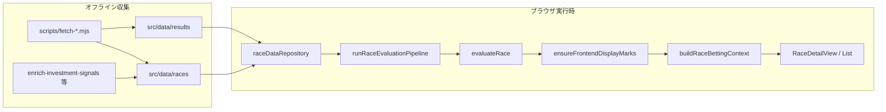

# 実装ロジック詳細一覧

本ドキュメントは、リポジトリ **競馬最強予想ファイルの改善版** に **現時点で実装済み** のロジックを、コードベースに基づいて網羅的にまとめたものです。  
（2026年5月時点の `src/`・`scripts/`・`python/` を対象）

---

## 目次

1. [システム概要](#1-システム概要)
2. [データ層](#2-データ層)
3. [アプリケーション構成（React）](#3-アプリケーション構成react)
4. [レース評価ドメイン](#4-レース評価ドメイン)
5. [評価パイプラインと ViewModel](#5-評価パイプラインと-viewmodel)
6. [馬券・回収ドメイン](#6-馬券回収ドメイン)
7. [バックテスト](#7-バックテスト)
8. [UIコンポーネントの責務](#8-uiコンポーネントの責務)
9. [オフラインスクリプト（Node）](#9-オフラインスクリプトnode)
10. [Python ML パイプライン](#10-python-ml-パイプライン)
11. [定数・閾値早見表](#11-定数閾値早見表)
12. [テストと品質保証](#12-テストと品質保証)
13. [関連ドキュメント](#13-関連ドキュメント)

---

## 1. システム概要

### 1.1 二系統のアーキテクチャ

本プロジェクトは **実行時に統合されていない二系統** で構成されています。

| 系統 | 技術 | 役割 | データ源 |
|------|------|------|----------|
| **フロント（本番 UI）** | React + TypeScript + Vite | レース評価・印・馬券推奨・バックテスト表示 | 静的 JSON（`src/data/`） |
| **Python ML** | LightGBM + SQLite | netkeiba DB 収集・学習・単勝 EV シミュレーション | `python/data/db/keiba.db` |

緩い結合として、`src/data/results/*.json` の race_id が Python `collect-quick` の収集種になります。

**Phase 1（2026-05）以降:** フロントは実行時に Python を呼びませんが、`scripts/backfill-ai-predictions.py` で書き込んだ **`entries[].ai_predicted_win_rate` / `ai_effective_ev`** を JSON から読み、レース詳細で `?engine=ai` 時のみ表示・EV券に利用します。印・`finalEvaluationScore`・`final_expected_value` は TS 系統のまま上書きしません。

### 1.2 エンドツーエンド（フロント）



---

## 2. データ層

### 2.1 ファイル配置

| パス | 内容 |
|------|------|
| `src/data/index.json` | レース一覧（`raceId`, `date`, `venue`, `raceNumber`, `raceName`, `surface`, `distance`, `raceGrade?`） |
| `src/data/races/{raceId}.json` | 出馬表・能力値・条件・過去走・投資シグナル・事前計算 `evaluation` |
| `src/data/results/{raceId}.json` | 着順 `places[]`、確定配当 `payouts`（WIN/REN/WREN/TRI） |
| `src/data/backtest_summary.json` | Vitest バックテスト生成の集計（`/backtest` ページ用） |

**raceId 形式:** netkeiba 12 桁（例: `202604010601` = 2026/04/01 中山 1R）

### 2.2 レース JSON の主要フィールド

- **`raceInfo`**: 日付・場・距離・芝/ダ・クラス名・グレード等
- **`condition`**: `RaceCondition` 相当（馬場・ペース・バイアス・`raceAnalysis`・会議フェーズ等）
- **`entries[]`**: 各馬の `abilities`（5軸）、`pastRuns`、`signals` / `investment`、`pedigree`、`horseNumber`（馬番）
- **`evaluation`**（任意）: オフライン `recompute-race-evaluations.ts` で書き込まれた評価ブロック
- **Phase1 Python ML（任意）**: `ai_predicted_win_rate`（Isotonic+レース内正規化済み勝率）、`ai_effective_ev`（`(ai_predicted_win_rate × odds) - 0.15`）。`predicted_win_rate` / `final_expected_value` とは別フィールド

### 2.3 結果 JSON

```typescript
places: { place, horseId?, horseName?, horseNumber?, corners?, margin? }[]
payouts?: {
  WIN?: { numbers: number[], dividend: number }[]
  REN?: ...   // 馬連（MAIN_LINE 照合）
  WREN?: ...  // ワイド
  TRI?: ...   // 3連複
}
```

配当は **100円あたり** の金額。`payoutCalculator` が組み合わせキー（馬番ソート済み `1-3-5`）で検索。

### 2.4 キャッシュ（開発時）

- `raceDataRepository`: 開発モードで JSON をキャッシュバスト取得
- 結果: `localStorage` キー `race-result-cache:{raceId}` + メモリキャッシュ
- `ensureRaceResultFetched`: 結果未取得時に API/スクリプト経由で取得

---

## 3. アプリケーション構成（React）

### 3.1 エントリ

- `src/main.tsx`: `ReactDOM.createRoot` + `BrowserRouter`
- `src/App.tsx`: ナビ・テーマ（`localStorage`）・ルート

### 3.2 ルーティング

| パス | ページ | 主な処理 |
|------|--------|----------|
| `/` | リダイレクト | → `/races` |
| `/races` | `RacesListPage` | 日付→場→`RaceListCard`、印的中率・回収率（直近30レース） |
| `/race/:raceId` | `RaceDetailPage` | `getRaceEvaluationById`、4秒ポーリング（dev）、`?engine=ai` で勝率ソース切替 |
| `/backtest` | `BacktestDashboardPage` | `backtest_summary.json` 表示 |

### 3.3 勝率エンジン切替（Phase 1）

レース詳細（`RaceDetailView`）で **TS評価** / **Python AI** を切替。URL クエリ `?engine=ai` でも指定可。

| モード | 勝率 | 期待値表示 | EV推奨馬券の確率 | 印・スコア |
|--------|------|------------|------------------|------------|
| **TS**（既定） | Softmax(`finalEvaluationScore`, T=1.5) | JSON `final_expected_value` | TS 勝率 × オッズ | `evaluateRace` |
| **AI** | JSON `ai_predicted_win_rate` | JSON `ai_effective_ev` | AI 勝率 × オッズ | 同左（TSのまま） |

実装: `src/lib/pipeline/probabilityEngine.ts` → `runRaceEvaluationPipeline({ probabilityEngine })` → `buildRaceEvaluationViewModel`。`ai_*` 未バックフィル時は TS にフォールバック。

**未連携:** レース一覧の回収率・`/backtest` は TS バックテストのまま。

### 3.4 レース一覧の集計ロジック

`src/app/races/page.tsx`:

1. `getRaceIndex()` で日付降順タブ
2. 表示レースごとにバックグラウンドで `ensureRaceResultFetched`
3. **印的中率（直近30）**: `evaluateRace` → `ensureFrontendDisplayMarks` → `analyzeMarkHits`（◎○▲が3着以内に含まれるか）
4. **回収率（直近30）**: `computeRaceBettingOutcomeById` → `mergeListBettingRecoveryStats`（**フォーメーション券**ベース）
5. **プレビュー**: `buildRacePreviewDataFromRace`（人気とAI順位のギャップ）

---

## 4. レース評価ドメイン

ディレクトリ: `src/domain/race-evaluation/`

### 4.1 型モデル（`abilityTypes.ts`）

#### 能力5軸

`speed`, `stamina`, `kick`, `sustain`, `power`（0〜100 想定）

#### 走法

`逃げ` | `先行` | `好位` | `差し` | `追込`（デフォルト `好位`）

#### 重み

`WeightSet`: 5軸の重み。`MIN_WEIGHT=0.05`, `MAX_WEIGHT=0.45`

#### 馬ごとのシグナル（`HorseEvaluationSignals`）

- `winOdds`, 直近大敗回数、2桁着順回数、好走回数
- `reproducibility01`, `gradedRaceTier`
- 騎手・調教師のコース勝率/複勝率
- 気性リスク `temperamentConcern01`

#### 投資ブロック（`InvestmentCommentInput`）

- `finalExpectedValue`（enrich 保存・**表示の単一ソース**）
- `valueRank` S/A/B/C/D、`betType`、`kellyWeight` 等

### 4.2 評価の中心: `evaluateRace`（`scoreCalculator.ts`）

**設計原則:**

- **能力値主軸**: レース内相対スコアを主軸に、適性ボーナスによる逆転幅を制限
- **印は評価内で付けない**: `evaluateRace` 終了時点では印未割当（コメント L701 付近）。印は `ensureFrontendDisplayMarks` で後段処理

#### 処理フロー（概要）

```
1. 馬データ前処理
   - abilitiesPrecomputedFromPastRuns でなければ blendAbilityWithPastRuns + applyKickL2Emphasis

2. レース文脈
   - resolveEffectiveRacePace, inferPaceSeverityKind
   - estimateFourthCornerRanking（4角位置予測）
   - pace/kick マップ構築

3. 第1パス（各馬）
   - calcHorseScore（重み付き5軸）
   - intrinsic: baseAbilityCore + reproducibilityDelta - riskPenalty + enginePeak + クラス/穴馬トリガー
     → compressIntrinsicTailScore
   - raceAdjustedInput: intrinsic + conditionScore + maxPerformance + 各種ボーナス
   - ラップ適合、RPCペナルティ、分散、役割ヒント

4. フィールド相対化
   - computeRaceRelativeScores(raceAdjustedInput)
     z-score → 50±12σ を 35〜85 にクリップ
     分散が極小のとき min-max フォールバック

5. 第2パス（各馬）
   - ペース適合ボーナス（◎+5, ○+2, ×-5, 極端×-10）
   - contextualBonuses（血統・枠・騎手・トリップ等、スタック上限あり）
   - combineFinalEvaluationScore
     final = raceRelative + clamp(finalRaw - raceRelative, ±MAX_APTITUDE_SWING)
     MAX_APTITUDE_SWING_FINAL = 8.0, BASELINE = 6.0

6. ランク付け
   - baseRank, adjustedRank, finalRank（各スコアでソート）

7. 事後処理
   - detectOddsDistortion（割安フラグ）
   - collectDismissIds → assignBuyLabels（消し・買いラベル）
   - generateScoreReason, predictionShortComments
```

#### 重要な上限定数（`scoreCalculator.ts`）

| 定数 | 値 | 意味 |
|------|-----|------|
| `MAX_COURSE_TRAIT_TOTAL` | 8.5 | コース特性ボーナス合計上限 |
| `COURSE_TRAIT_PLUS_RESILIENCE_CAP` | 12.0 | コース特性+耐性の合算上限 |
| `LAP_STACK_TOTAL_CAP` | 16.8 | ラップ系ボーナス合計上限 |
| `MAX_APTITUDE_SWING_FINAL` | 8.0 | 最終評価の適性起因スイング上限 |
| `BIAS_DISADVANTAGE_RECOVERY_BONUS` | 7.0 | 前走バイアス逆行の巻き返し補正 |

### 4.3 基礎能力スコア（`abilityCoreScoring.ts`）

```text
baseAbilityCore = mean(5軸) × 0.75 + top2平均 × 0.25
```

**過去走エンジン信号（`pastRunToEngineSignal`）:**

- 着差あり: `100 - marginSec × 30`（0〜100）
- 着順のみ: `100 - (place-1) × 8`

**ピーク合成:** 上位2走 `top1×0.7 + top2×0.3`（1走のみは ×0.65）

### 4.4 重み解決（`weightResolver.ts`, `courseWeights.ts`, `strategicWeights.ts`）

1. コースキー（場・芝ダ・距離）から `getBaseWeights`
2. 馬場・トラック速度・バイアス・ペース・`adjustmentStrength` で乗算調整
3. 会場物理要因（`venuePhysicalFactors.ts`）
4. バイアスマスタ（`biasMasterLookup.ts`）の傾き
5. 馬ごと: ペース厳しさ増幅、枠番ゲート比率（`FRAME_GATE_WEIGHT_RATIO`）

`calcHorseScore(horse, weights)` = Σ(能力値 × 重み) / Σ重み

### 4.5 レース内相対スコア（`finalScoring.ts`）

- 通常: z-score → `50 + z×12`、35〜85
- `combineFinalEvaluationScore`: `raceRelativeScore` と raw のブレンド（`ABILITY_RELATIVE_BLEND`）

**ペース適合ボーナス:**

| トークン | 加点 |
|----------|------|
| PERFECT | +5 |
| FIT | +2 |
| MAYBE | 0 |
| BAD | -5 |
| 極端BAD（前残り×スロー×追込等） | -10 |

### 4.6 消しルール（`dismissalRules.ts`）

4条件のうち **2件以上** で消し候補:

1. `finalRank > fieldSize - 2`（後方）
2. 適性 `fitLevel === LO`
3. ペース適合 `BAD`
4. `scoreDiff <= -1.0`

`venueRepeaterDismissRescue` で1件救済可能。

### 4.7 その他の評価モジュール（実装済み）

| モジュール | 役割 |
|------------|------|
| `paceFit.ts` | 走法×レースペース → PERFECT/FIT/BAD、消耗戦スタミナ耐性 |
| `lapShapeFit.ts` | 過去ラップ形状 vs 当日、RPC ペースミスマッチペナルティ |
| `distanceFit.ts` | 距離適性ボーナス |
| `classLevelScore.ts` | クラスレベルボーナス |
| `contextualBonuses.ts` | 血統・枠×バイアス・騎手・コネクション・トリップ |
| `structuralPhysicalBonuses.ts` | 体格・枠の構造ボーナス |
| `storedRaceAnalysisBonus.ts` | JSON `raceAnalysis` 由来ボーナス |
| `oddsDistortion.ts` | オッズと能力の乖離検出 |
| `longshotReversal.ts` | 穴馬巻き返し intrinsic ブースト |
| `classTriggerMultipliers.ts` | クラス別 intrinsic 倍率 |
| `estimatedFourthCorner.ts` | 4角順位予測・先行有利補正 |
| `markAssigner.ts` | 印ロール（△1安定等）、三角印数 |
| `resolveEffectiveRaceClass.ts` | `ClassTier`（MAIDEN_NEW … GRADED_OPEN） |
| `racePreview.ts` | `gap = expectedPopularity - systemRank` |
| `markHitAnalysis.ts` | 印的中判定（3着以内） |
| `buyLabel.ts` | 買いラベル（軸・相手・見送り等） |
| `reasonGenerator.ts` | スコア理由テキスト |
| `valueRankFromEffectiveEv.ts` | EV→S/A/B/C/D ランク（10/8/3/1 閾値） |

### 4.8 表示用印（`ensureFrontendDisplayMarks.ts`）

`evaluateRace` の結果をコピーし:

1. `assignHokkakeRoles`（補欠け役割）
2. `fillAllRequiredMarksForDisplay` — ◎○▲☆△ を **必ず** 1頭ずつ（DISMISS 馬も含む全頭から）
3. `ensureTriangleMarks` — 追加の △ 印
4. ☆は `finalRank>=6` かつ `baseRank-finalRank>=3` かつ `scoreDiff>=0.5` を優先

`markAssigner.applyCornerLeadFavoritePromotion`: 能力1位が4角10番手以下予測なら、能力上位の先行馬を ◎ に昇格可能。

---

## 5. 評価パイプラインと ViewModel

### 5.1 `runRaceEvaluationPipeline`（`evaluationPipeline.ts`）

```typescript
raw = evaluateRace(horses, condition)
results = ensureFrontendDisplayMarks(raw, horses, condition)
tsProbabilities = softmax(finalEvaluationScore, T=1.5)
{ probabilities, engineUsed } = resolveAdjustedProbabilities(horses, tsProbabilities, options.probabilityEngine)
isSkippableRace = (mathFirstByFinalRank.horseId !== display◎.horseId)
viewModel = buildRaceEvaluationViewModel(..., { probabilityEngine: engineUsed })
```

戻り値に `probabilityEngine: 'ts' | 'ai'` を含む（AI 要求時に `ai_*` 欠損なら `'ts'` にフォールバック）。

### 5.2 Softmax（`normalization.ts`）

```text
P_i = exp((score_i - maxScore) / T) / Σ exp(...)
T = 1.5 固定（effectiveSoftmaxTemperature は常に 1.5 を返す）
```

分母≈0 のとき一様分布。

### 5.3 ViewModel（`raceEvaluationViewModel.ts`）

- レーダーチャート用の正規化加重能力
- 勝率: `probabilityEngine === 'ai'` なら `horse.aiPredictedWinRate`、それ以外は Softmax
- 期待値: AI モードは `horse.aiEffectiveEv`、TS モードは **`finalExpectedValue` を JSON のみ参照**（フロントで再計算しない）
- Kelly 表示、`evHot` if EV > 1.2（`FINAL_EXPECTED_RECOMMEND_THRESHOLD`）
- オッズ歪みによる確率ブーストは **削除済み**
- ViewModel ルートに `probabilityEngine` を保持（UI 表示用）

---

## 6. 馬券・回収ドメイン

ディレクトリ: `src/domain/betting/`

### 6.1 二種類の券種生成

| 種別 | 関数 | 用途 |
|------|------|------|
| **フォーメーション** | `generateFormationBetTickets` | 回収率集計・バックテストの **正** |
| **EV 推奨** | `generateTicketsFromEvaluation` | 単勝/馬連/ワイド/3連複の期待値フィルタ |

### 6.2 フォーメーション券（`bettingRules.ts`）

◎が存在しない場合は空。

| ticketType | 内容 |
|------------|------|
| `WIN` | ◎ 単勝のみ |
| `MAIN_LINE` | ◎-○ 馬連（ソート済み2頭） |
| `WIDE` | ◎ × (○▲☆△) 全ペア |
| `TRIFECTA_FORM` | ◎ × 2列目 × 3列目（`buildOptimizedTrifectaCombinations`） |

**2列目（`buildSecondRowNumbers`）:**

- `MAIDEN_NEW`: ○ と ▲ のみ
- 通常: ○, ▲
- `GRADED_OPEN`: + △1安定, + 穴☆（longshotReversalTrigger）, + connectionsBonus≥2.5 のバックアップ1頭
- `CONDITIONAL_UPPER` 以下: + △1安定

**3列目（`buildThirdRowNumbers`）:**

- ○, ▲, ☆（longshotStar 以外）, △（hokkakeRole がヒモ役、または finalRank≤5）

### 6.3 EV 券（`bettingRules.ts`）

**前提:**

- `isSkippableRace === true` → **EV 券ゼロ**（フォーメーションは生成される）
- 勝率 < 1% の馬は全券種除外（`VALID_PROB_THRESHOLD = 0.01`）
- **直前オッズのみ**。欠損時はその組み合わせをスキップ（推定しない）

**閾値:**

| 券種 | EV 閾値 |
|------|---------|
| WIN / REN / WREN | 1.3（`DEFAULT_EV_THRESHOLD`） |
| TRI | 1.5（`DEFAULT_TRI_EV_THRESHOLD`） |
| MAIDEN_NEW | 3連複 EV ループ自体スキップ |

**確率近似:**

```text
ペア（馬連・ワイド）:
  P(A,B) = pA×pB/(1-pA) + pB×pA/(1-pB)   // Harville 型

3連複:
  P(A,B,C) ≈ pA×pB×pC × (1/d1 + 1/d2)
  d1 = (1-pA)(1-pA-pB), d2 = (1-pB)(1-pB-pA)
  退化時は pA×pB×pC×6
```

```text
EV = estimatedProbability × odds
```

### 6.4 見送り判定（表示用）

`resolveBettingAdvisoryReason`:

- `no_marks` — 印なし
- `contradictory_marks` — `isSkippableRace`
- `no_ev_recommendation` — EV 券0件

**回収集計には影響しない。**

### 6.5 払戻計算（`payoutCalculator.ts`）

| ticketType | 的中条件 |
|------------|----------|
| WIN | 1着 = comb[0] |
| MAIN_LINE | comb の2頭が **1-2着** に含まれる |
| WIDE | comb の2頭が **1-3着** に含まれる |
| TRIFECTA_FORM | comb の3頭が **1-3着** に含まれる |

配当優先順位:

1. `officialPayouts` の確定配当（100円あたり × 購入額/100）
2. WIN のみ、配当なし時は保存オッズから推定

### 6.6 単レース outcome（`computeRaceBettingOutcome.ts`）

リストカード用。フォーメーション券 + 結果 JSON → 投資額・払戻・的中フラグ。

### 6.7 2列目全滅診断（`secondRowAnalysis.ts`）

◎が3着以内にいるが、2列目候補馬が3着以内に **1頭もいない** レースを集計（3連複弱点の診断）。

### 6.8 フォーメーション的中マーク（`markFormationHits.ts`）

購入有無に関わらず、印パターンが的中したかをフラグ化。

---

## 7. バックテスト

### 7.1 実行方法

```bash
npm run backtest:bets
# → vitest run src/domain/betting/runFullBacktest.test.ts
# → src/data/backtest_summary.json を更新
```

### 7.2 `runBacktest.ts` の1レース処理

1. `evaluateRace` + `ensureFrontendDisplayMarks`
2. Softmax 勝率
3. `generateFormationBetTickets` → `calculateRacePayout`
4. 並行して `generateBetTicketsFromEvaluation`（EV、診断用）
5. `buildRaceDetailLog`（◎診断・2列目・見送り理由）
6. `computeFavoriteMarkHit`（◎単勝/複勝統計）

**スキップ条件:**

- 印なし（`no_marks`）
- 着順3頭未満（`insufficient_results`）

### 7.3 集計（`aggregateBacktest`）

- 券種別: 投資・払戻・回収率・的中率
- クラス別・グレード別
- ◎ 統計・`raceDetails[]`（ダッシュボード用）

---

## 8. UIコンポーネントの責務

| コンポーネント | 責務 |
|----------------|------|
| `RaceDetailView` | タブ（馬券/馬一覧/結果）、`runRaceEvaluationPipeline`、**TS/Python AI 勝率トグル**（`?engine=ai`）、条件パネル連動・localStorage 引き継ぎ |
| `RaceAdjustmentPanel` | 馬場・ペース・バイアス・調整強度。変更で即再評価 |
| `RaceHorsesView` / `HorseEvaluationCard` | 馬ごとのスコア・能力・レーダー |
| `RaceBettingDashboard` | `buildRaceBettingContext`、フォーメーション表示、EV 件数（`probabilityEngine` 表示）、コピー用テキスト |
| `RaceResultPanel` / `RaceResultAnalysis` | 結果・印的中・払戻内訳 |
| `RaceListCard` | 一覧カード、回収 outcome 色分け |
| `EvHeatmap` | 馬×券種 EV ヒートマップ |
| `BacktestHitRacesSection` | バックテスト的中/外れレース一覧 |
| `FinishPlaceLabel` | 着順 + 印ラベル |

**条件の引き継ぎ:** `date:venue:surface` キーで localStorage にユーザー調整を保存。

---

## 9. オフラインスクリプト（Node）

`package.json` の npm scripts と対応する `scripts/` 実装。

### 9.1 データ取得

| スクリプト | 処理 |
|------------|------|
| `fetch-races-from-netkeiba.mjs` | 出馬表スクレイプ → `races/*.json` + `index.json` |
| `fetch-past-runs.mjs` | 過去走履歴のバックフィル |
| `fetch-race-results.mjs` | 結果・配当 → `results/*.json` |
| `fetch-live-odds.mjs` | JRA/netkeiba 直前オッズ → race JSON `signals` |

### 9.2 オッズ・投資シグナル

| スクリプト | 処理 |
|------------|------|
| `generate-latest-odds-csv.mjs` | 最新オッズ CSV 出力 |
| `refresh-latest-odds.mjs` | オッズ更新ラッパ |
| `reset-market-odds.mjs` | 市場オッズフィールドリセット |
| `apply-external-odds.mjs` | 外部 CSV → race JSON + signals 再計算 |

### 9.3 能力・評価の再計算

| スクリプト | 処理 |
|------------|------|
| `reestimate-abilities-from-past-runs.mjs` | 過去走から5軸能力を再推定 |
| `recompute-race-evaluations.ts` | 全 race JSON に `evaluateRace` 結果を書き込み |
| `enrich-investment-signals.mjs` | `final_expected_value`, value rank, investment ブロック |
| `build-daily-baseline.mjs` | 日次ベースライン統計 |
| `build-sire-stats.mjs` | 父馬統計マスタ（血統ボーナス用） |

### 9.4 コンテキスト・バイアス

| スクリプト | 処理 |
|------------|------|
| `apply-trip-context.mjs` | トリップ/バイアス文脈 |
| `apply-prev-day-conditions.mjs` | 前日条件の会議横展開 |
| `apply-tokyo-meeting-bias-brief.mjs` | 東京開催バイアスブリーフ |
| `update-bias-master`（enrich オプション） | バイアスマスタ更新 |

### 9.5 その他

| スクリプト | 処理 |
|------------|------|
| `backfill-index-race-grade.mjs` | index の `raceGrade` 補完 |
| `aggregate-mark-hit-rates.ts` | CLI 印的中率集計 |

### 9.6 Python ML 連携（Node 外・別実行）

| スクリプト | 処理 |
|------------|------|
| `scripts/backfill-ai-predictions.py` | 学習済み `lgbm_model.pkl` + `betting_evaluator.pkl` で全 `src/data/races/*.json` に `ai_predicted_win_rate` / `ai_effective_ev` を追記（既存 enrich フィールドは上書きしない） |

前提: `python main.py train` 済み、`python main.py collect-quick` で DB にオッズ入り。

### 9.7 共有ライブラリ（`scripts/lib/`）

- `parseRaceResultNetkeiba.mjs`, `parseNetkeibaPayouts.mjs` — HTML パース
- `investmentSignals.mjs` — EV/Kelly/value rank（TS `valueRankFromEffectiveEv` と整合）
- `abilityScorer.mjs`, `estimateAbilitiesFromPastRuns.mjs`
- `raceAnalysis.mjs` — ラップ構造・バイアススコア
- `biasMaster.mjs` — トラックバイアスマスタ
- `jraDriver.mjs` — Playwright で JRA オッズ

---

## 10. Python ML パイプライン

ディレクトリ: `python/`（フロントとは **別実行系**）

### 10.1 CLI（`main.py`）

| コマンド | 説明 |
|----------|------|
| `collect` | 全年・全会場を日付巡回で DB 収集 |
| `collect-quick` | `src/data/results/*.json` + `golden_races.json` の race_id のみ |
| `train` | 前処理→特徴量→Label Encoding→LightGBM→`models/` 出力 |
| `simulate` | テスト期間で EV スイープ・ベースラインレポート |
| `optimize` | 閾値グリッド最適化（グラフ中心） |
| `golden-test` | DB vs Feature Bridge 不変性テスト |
| `predict --race-id` | 1レース推論 + `BettingEvaluator` 推奨 |

**Phase 1 連携（フロント JSON）:**

```bash
python3 scripts/backfill-ai-predictions.py          # 全 races/*.json
python3 scripts/backfill-ai-predictions.py --race-id 202604010601
```

`model_bundle.json` の `extra_meta` に `enable_ev_sample_weight`, `ev_weight_center`, `ev_weight_tau` を記録。

### 10.2 データ収集（`scraper.py`）

- ソース: `https://db.netkeiba.com`（Selenium + requests）
- SQLite WAL: `race_info`, `race_results`, `payouts`, `horse_results`, `pedigree`
- `REQUEST_INTERVAL=1.5s`, `MAX_RETRY=3`
- **出馬表 `race_table_01` 列インデックス（2026-05 修正）:** 16=単勝オッズ、17=人気（旧 9/10 は NULL 化の原因）。`race_info` ありかつ `odds` が全 NULL の race_id は再スクレイプ（DELETE+INSERT）
- **払戻 `pay_table_01`:** `th,td` 併用で列ずれを防止。`ticket_type` は `win`/`place` 等に正規化。`simulator._get_win_payout` は `win`・`単勝` 双方に対応。古い DB は `collect-quick` で再取得

### 10.3 特徴量（`feature_engineer.py`）

**リーク防止:** 馬・騎手・調教師統計は `shift(1).expanding()` / rolling（当該レースより前のみ）

主要特徴:

- 馬: 勝率・複勝率・平均着順・前走・休養日数
- 騎手/調教師: 通算勝率・複勝率、会場別
- 条件別: 距離カテゴリ・芝ダ・馬場・会場
- 季節: 月・四季
- 脚質: 先頭コーナー通過から逃げ/先行/差し/追込
- ~~スピード指数~~: **学習特徴から除外**（当該レース `finish_time` 由来のリーク）

**目的変数（`make_target`）:**

- `win`: 1着
- `top3`: 3着以内
- `win_mod`: 1着または同着タイム

### 10.4 モデル（`model.py`）

- LightGBM binary、約50特徴列
- `StratifiedGroupKFold`（`groups=race_id`, 5 fold）で OOF AUC
- テスト: `TEST_YEARS=[2024,2025]`、不足時は末尾20%ホールドアウト
- **期待値シグモイド重み付け**（`ENABLE_EV_SAMPLE_WEIGHT=True` 時）:
  1. **Pass1:** 重みなし StratifiedGroupKFold OOF → レース内で確率正規化
  2. 理論 EV = `oof_pred_norm × odds`（オッズ NULL 行は重み 0）
  3. シグモイド `w = 1/(1+exp(-(EV-center)/tau))`（`center=0.9`, `tau=0.02`）→ レース内で **合計 1** に再正規化
  4. **Pass2:** 上記 `sample_weight` で CV + 最終 `lgb.train`
- `ENABLE_EV_SAMPLE_WEIGHT=False` または `Model.tune()` は従来の単一パス（無重み）
- `speed_index` は `FEATURE_COLS` から恒久的除外

### 10.5 シミュレータ（`simulator.py`）

- レースごと: キャリブレーション → 確率正規化 → **実質 EV** = `P×O - margin`（margin=0.15）
- `EV >= threshold` かつ `odds >= min_odds` の **EV最大1頭** に100円単勝
- `optimize_threshold`: EV 1.0〜3.5 を40段階

### 10.6 馬券評価（`betting_evaluator.py`）

- Isotonic/Platt キャリブレーション
- クォーターケリー（fraction=0.25, max=0.25）
- 1番人気に EV -0.05 補正（オプション）
- `MIN_EV_THRESHOLD=1.05`（config）

### 10.7 アーティファクト（`artifacts.py`）

`train` 後に出力:

- `lgbm_model.pkl`, `processor.pkl`, `feature_engineer.pkl`
- `entity_stats_snapshot.pkl`, `feature_manifest.json`, `model_bundle.json`

### 10.8 Feature Bridge（`feature_bridge.py`）

| 関数 | 状態 | 説明 |
|------|------|------|
| `build_features_from_db` | 実装済 | 学習パイプラインと同一の DB 特徴量 |
| `build_features_from_ts_json` | 実装済（best-effort） | `src/data/races/{id}.json` の `entries` / `pastRuns` / `investment.actualOdds` 等をマッピング。`entity_stats_snapshot.pkl` のデフォルトで欠損補完 |
| `build_features_for_race` | 実装済 | **DB 優先** → 無ければ TS JSON Bridge |

TS JSON 単体は DB 学習行と **完全一致しない**（`golden_invariance` は DB パス前提）。バックフィルは DB がある環境で実行推奨。

### 10.9 TS との意図的アライメント（部分配線）

| 概念 | Python | TypeScript | 連携状況 |
|------|--------|------------|----------|
| 確率フロア | 0.01 | `VALID_PROB_THRESHOLD` | 未統一 |
| EV 閾値 | 1.05（単勝 simulate） | 1.3（WIN 等） | 未統一 |
| 実質 EV 式 | `P×O - 0.15` | `final_expected_value`（enrich 時） | AI モードで `ai_effective_ev` は同型 |
| 券種 | 単勝のみ（simulate） | WIN/REN/WREN/TRI | 別系統 |
| 確率源 | LGBM + Isotonic + レース内正規化 | Softmax(finalScore, T=1.5) | **Phase 1:** レース詳細で `?engine=ai` 時のみ JSON `ai_*` を表示・EV券に使用 |
| 印・スコア | — | `evaluateRace` | **常に TS**（上書きなし） |

### 10.10 Phase 1 接続仕様（2026年5月）

1. **非結合上書き禁止:** `predicted_win_rate` / `final_expected_value` は触らず、`ai_predicted_win_rate` / `ai_effective_ev` を追記
2. **バックフィル:** `scripts/backfill-ai-predictions.py` → `probabilityEngine.ts` → `RaceDetailView` トグル（§3.3）
3. **テスト:** `src/lib/pipeline/probabilityEngine.test.ts`（AI 欠損時 TS フォールバック等）

---

## 11. 定数・閾値早見表

### 11.1 評価・確率

| 名前 | 値 | 場所 |
|------|-----|------|
| Softmax 温度 T | 1.5 固定 | `normalization.ts` |
| 適性スイング上限（最終） | ±8.0 | `scoreCalculator.ts` |
| baseAbilityCore ブレンド | 0.75 mean + 0.25 top2 | `abilityCoreScoring.ts` |
| 消し条件数 | ≥2 / 4 | `dismissalRules.ts` |
| scoreDiff 消し閾値 | ≤ -1.0 | `dismissalRules.ts` |

### 11.2 馬券（TS）

| 名前 | 値 | 場所 |
|------|-----|------|
| VALID_PROB_THRESHOLD | 0.01 | `bettingRules.ts` |
| DEFAULT_EV_THRESHOLD | 1.3 | `bettingRules.ts` |
| DEFAULT_TRI_EV_THRESHOLD | 1.5 | `bettingRules.ts` |
| FINAL_EXPECTED_RECOMMEND_THRESHOLD | 1.2 | `investmentEvConstants.ts` |
| AI_EFFECTIVE_EV_THRESHOLD | 1.05 | `investmentEvConstants.ts`（AI モード単勝 EV 券） |
| PYTHON_EV_MARGIN | 0.15 | `investmentEvConstants.ts` |
| フォーメーション購入額 | 100円/点 | 各所デフォルト |

### 11.3 Python

| 名前 | 値 | 場所 |
|------|-----|------|
| MIN_EV_THRESHOLD | 1.05 | `config.py` |
| margin（実質EV） | 0.15 | `betting_evaluator.py` |
| BET_UNIT | 100 | `config.py` |
| TEST_YEARS | 2024, 2025 | `config.py` |
| ENABLE_EV_SAMPLE_WEIGHT | True | `config.py` |
| EV_WEIGHT_CENTER | 0.9 | `config.py`（シグモイド中心） |
| EV_WEIGHT_TAU | 0.02 | `config.py`（シグモイド温度） |

---

## 12. テストと品質保証

### 12.1 Vitest（TypeScript）

- `src/domain/race-evaluation/*.test.ts` — ペース適合、コンテキストボーナス、venue 等
- `src/domain/betting/*.test.ts` — EV 計算、フォーメーション、払戻、バックテスト
- `src/lib/race-display/ensureFrontendDisplayMarks.test.ts`
- `src/lib/pipeline/probabilityEngine.test.ts` — TS/AI 勝率解決・フォールバック
- `src/components/race/betBuilder.test.ts`

### 12.2 Python

- `python/test_artifacts.py` — アーティファクト・同着ラベル
- `golden_invariance.py` — `golden_races.json` 固定 race の **DB 特徴量** 不変性（TS JSON Bridge パリティは別途）

### 12.3 ゴールデンレース

- `python/golden_races.json` — TS/Python 共通の検証用 race_id セット

---

## 13. 関連ドキュメント

本ファイルは **実装の全体像** を目的としています。個別仕様・設計意図は以下も参照してください。

| ファイル | 内容 |
|----------|------|
| `docs/EvaluationLogic.md` | 評価ロジック仕様 |
| `docs/race-evaluation-spec.md` | レース評価仕様 |
| `docs/scraping-architecture.md` | スクレイピング構成 |
| `docs/current-site-implementation.md` | サイト実装状況 |
| `docs/実装内容まとめ.md` | 従来の実装まとめ |
| `docs/venue-evaluation-logic.yaml` | 会場別ロジック定義 |

---

## 付録: 主要ソースファイル索引

### TypeScript ドメイン

```
src/domain/race-evaluation/
  scoreCalculator.ts      # evaluateRace 本体
  abilityCoreScoring.ts   # 基礎・intrinsic・raceAdjusted
  finalScoring.ts         # 相対スコア・最終合成
  weightResolver.ts       # 重み・calcHorseScore
  dismissalRules.ts       # 消し
  markAssigner.ts         # 印ロール
  betting/                # 馬券・払戻・バックテスト

src/lib/pipeline/
  evaluationPipeline.ts
  probabilityEngine.ts    # TS/AI 勝率切替
  normalization.ts

src/viewModel/
  raceEvaluationViewModel.ts

scripts/
  backfill-ai-predictions.py

src/lib/race-display/
  ensureFrontendDisplayMarks.ts

src/lib/race-data/
  raceDataRepository.ts
  buildEvaluationData.ts
  computeRaceBettingOutcomeById.ts
```

### Python

```
python/main.py
python/scraper.py
python/data_processor.py
python/feature_engineer.py
python/model.py
python/simulator.py
python/betting_evaluator.py
python/artifacts.py
python/feature_bridge.py
python/golden_invariance.py
scripts/backfill-ai-predictions.py  # リポジトリルート
```

---

*最終更新: 2026-05（Phase 1: EV 重み付け学習・scraper 列修正・Feature Bridge・AI 勝率 UI）。実装変更時は該当セクションの更新を推奨します。*
