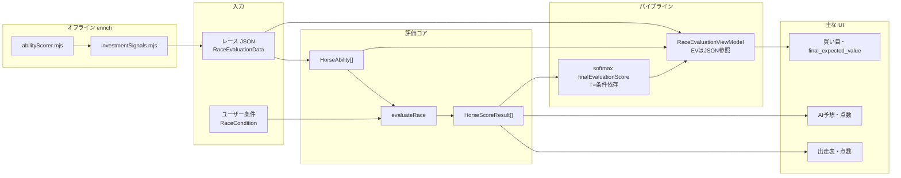

# 実装内容まとめ（全画面・計算ロジック一覧）

> **オッズ更新・Python AI（`ai_*`）・AI印・運用コマンド**の現状は  
> **[現状実装まとめ-2026-05.md](./現状実装まとめ-2026-05.md)** を正とする。本稿は点数・`evaluateRace`・enrich 中心。

レース詳細まわりでは **「点数（100点満点）」「補正後スコア（pt）」「単勝勝率 P」「期待値（final_expected_value）」** が並立します。用途が異なるため、まず用語を整理し、**データの流れ** と **評価コア `evaluateRace`**、**enrich（JSON）** を俯瞰します。

詳細な「画面要素 ↔ フィールド対応」は `docs/実装内容まとめ共有用.md` を参照してください（本稿はフローと式の要約に寄せています）。

---

## 1. 用語の整理（最重要）

### 1.1 「点数」（100点満点）

| 画面 | 実体 | 意味・計算 |
|------|------|------------|
| **出走表「点数」列** | `adjustedScoreToPoints100(adjustedScore, maxAdjustedScoreInRace)` | 同一レース内で **補正後スコア `adjustedScore` が最大の馬を 100 点** とした換算（整数 + 「点」表示）。 |
| **AI予想タブのバー** | 上記と同じ関数・同じ分母 | バー長も **0〜100** に対応。文言は「◯◯点」。 |
| **詳細カードの「点数」** | 同上を親から `scorePoints100` として渡す | 「◯◯ / 100」表示。 |

**重要:** 点数は **馬単体の固定能力値ではない**。`adjustedScore` は **そのときの `RaceCondition`（馬場・バイアス・ペース・補正強度・ラップ・ゲート指定など）** を反映した加重スコアなので、**条件設定を変えると点数も変わる**。

### 1.2 「補正後スコア」（pt 相当の元データ）

| 項目 | 実体 |
|------|------|
| **`HorseScoreResult.adjustedScore`** | `calcHorseScore(horse, finalWeights)`。5 能力の **`finalWeights` は `RaceCondition` 依存**。 |

一覧・AI・カードの **点数の分子** はすべてこれ。**表示上は pt を直接は出さず、100 点換算に統一**している。

### 1.3 JSON（enrich）由来・オッズと独立／連動

| JSON フィールド | 意味 |
|-----------------|------|
| **`predicted_win_rate`** | バックエンド（`abilityScorer` + `investmentSignals`）で算出した **単勝勝率 P（0〜1）**。オッズ非依存。**既定では enrich のたびに固定**し、`--recalc-ability` でのみ再計算。 |
| **`final_expected_value`** | **\(P \times\) 単勝オッズ − `ev_margin_dynamic`**。単勝のみ（複勝実効オッズは使わない）。フロント・サーバで **期待値表示の単一ソース**。旧 `expected_value` / `value_score` は廃止して統合。 |
| **`ev_margin_dynamic`** | ルートに記録。レース種別・頭数・詳細補正数などから **`calcDynamicEvMargin`** で決まるマージン（約 0.08〜0.30）。 |

### 1.4 買い目タブ「補正スコア」列

**JSON の `finalExpectedValue`（= `final_expected_value`）を最優先**。無い場合のみ実行時に `winShareProbabilityForEv × actualOdds − margin` でフォールバック（レガシー）。

勝率シェア **`winShareProbabilityForEv`** は **`investment.predictedWinRate`（JSON）を最優先**し、無ければ ViewModel の確率、さらに無ければ `predictedProbability`。

---

## 2. データの流れ（全体）

1. **JSON** → `convertToRaceEvaluationData` で **`HorseAbility`**（投資ブロックに `predictedWinRate` / `finalExpectedValue` 等）。
2. **`runRaceEvaluationPipeline(horses, condition)`**（`src/lib/pipeline/evaluationPipeline.ts`）
   - **`evaluateRace`** → `HorseScoreResult[]`
   - **`finalEvaluationScore`** を softmax → `adjustedProbabilities`
   - **`buildRaceEvaluationViewModel`** … **期待値 `effectiveEv` は JSON の `final_expected_value` のみ**（オッズ歪みブーストによる確率の増幅は **しない**）。確率表示は **`predicted_win_rate` 優先**。
3. **`RaceDetailView`** が `pipeline.results` / `pipeline.viewModel` / `condition` を各タブへ分配。
4. **点数表示**は共通ヘルパー **`adjustedScoreToPoints100`**（`src/components/race/adjustedScorePoints100.ts`）。

---

## 3. `HorseScoreResult` の主なスコア系フィールド

| フィールド | 概要 |
|------------|------|
| `baseScore` | `calcHorseScore(horse, baseWeights)`。当日条件の **ベース重み** のみ。 |
| **`adjustedScore`** | `calcHorseScore(horse, finalWeights)`。**点数（100点）換算の入力**。条件変更で変動。 |
| `scoreDiff` | `adjustedScore - baseScore`。 |
| `intrinsicAbilityScore` | 第1層：素点系（基礎コア＋再現性−大敗＋エンジンピーク等）。 |
| `conditionFitDelta` | `adjustedScore - intrinsicAbilityScore`（カード上の「条件適性差」）。 |
| `raceRelativeScore` | `raceAdjustedInput` をレース内で相対化。 |
| **`finalEvaluationScore`** | 相対化・ラップ・文脈・コース特性等を合成。**印・最終順位の基準**。 |
| `evaluationBaselineScore` | 条件 Impact を弱めた参照ライン。 |

実装の中心は **`src/domain/race-evaluation/scoreCalculator.ts`** の **`evaluateRace`**。

---

## 4. `evaluateRace` 処理の骨格（簡略）

1. **能力の前処理** — `blendAbilityWithPastRuns`
2. **レース共通コンテキスト** — 実効ペース、4角予測、脚質シグナル等
3. **各馬** — `baseScore` / **`adjustedScore`** / intrinsic / raceAdjustedInput、ラップ・耐久バフ、`raceRelativeScore`
4. **第2パス** — 文脈ボーナス、コース特性・鞍上等 → **`combineFinalEvaluationScore`**
5. **順位** — `baseRank` / `adjustedRank` / **`finalRank`**
6. **オッズ歪み（結果オブジェクト）** — `detectOddsDistortion` は **印・結果オブジェクト用**。ViewModel の **確率ブーストは使わない**。

加点の一覧は `docs/実装内容まとめ共有用.md` の「§5.1 加点ロジック一覧」が対応表になります。

---

## 5. バックエンド enrich（期待値・単勝 P）

| 項目 | 実装 | 内容 |
|------|------|------|
| 単勝 P の固定 | `scripts/lib/abilityScorer.mjs` の **`computePredictedWinRates`** | 能力ウェイト・ゲート・ラップ指標・血統・ペース整合等 → softmax（T=4）。**`predicted_win_rate` に保存**。ロック時は再計算しない。 |
| 期待値の単一フィールド | `scripts/lib/investmentSignals.mjs` | **`final_expected_value = predicted_win_rate × 単勝オッズ − ev_margin_dynamic`**。 |
| 動的マージン | `calcDynamicEvMargin` | 新馬・重賞・16頭以上・詳細補正数など。ルート **`ev_margin_dynamic`** にも記録。 |
| 再計算フラグ | `node scripts/enrich-investment-signals.mjs --recalc-ability` | 環境変数で単勝 P のみ再計算。 |

オッズ更新時は **単勝オッズ・期待値だけ更新**し、**`predicted_win_rate` は既定では固定**。

---

## 6. パイプライン後段（ブラウザ）

| 項目 | 実装 | 内容 |
|------|------|------|
| ViewModel の期待値 | `buildRaceEvaluationViewModel` | **`horse.investment.finalExpectedValue` をそのまま `effectiveEv`**。オッズ歪みによる確率増幅は **適用しない**。 |
| 勝率表示の優先 | `adjustedWinProbability` | **`predictedWinRate`（JSON）があればそれ**、なければ softmax。 |
| 買い目テーブル | `RaceBetPanel.tsx` | **「補正スコア」列は `finalExpectedValue` 優先**。閾値 **`FINAL_EXPECTED_RECOMMEND_THRESHOLD`（1.2）** は `investmentEvConstants.ts`。 |
| 推奨バッジ | `FinalExpectedRecommendBadge.tsx` | **`final_expected_value` と共通閾値**。 |

---

## 7. 画面別：何の数字を見ているか

| 画面 | 主な計算ソース |
|------|----------------|
| **条件設定** | `RaceCondition` → `getFinalWeights` / キャリーオーバー / グローバルプロファイル。 |
| **出走表** | **点数** = `adjustedScore` の 100 点換算（レース内トップ基準）。印・買い・短評は `evaluateRace` / JSON。 |
| **AI予想** | **同上の点数**、右列は JSON の **3着内率（predictedProbability）**。 |
| **詳細カード** | **同上の点数**、`finalEvaluationScore`、各種ボーナス、**`FinalExpectedRecommendBadge`**（JSON 期待値）。 |
| **オッズ／買い目** | **`final_expected_value` 基準の表示を優先**、`betBuilder`、ヒートマップ。 |
| **結果タブ** | 確定着順との照合（評価式とは独立）。 |

---

## 8. オッズ・Python AI（2026-05 現状）

**運用の全体像・コマンド早見表**は **[現状実装まとめ-2026-05.md](./現状実装まとめ-2026-05.md)** を正とする。

| 区分 | 入口 | 主な出力フィールド |
|------|------|-------------------|
| オッズ（推奨） | `scripts/refresh-latest-odds.mjs`（デフォルト JRA） | `market_win_odds`, `market_observed_at` |
| enrich 期待値 | `apply-external-odds` 内の `enrichInvestmentSignalsInRaceData` | `final_expected_value`, `predicted_win_rate` |
| Python AI | `scripts/backfill-ai-predictions.py` | `ai_predicted_win_rate`, `ai_effective_ev` |
| AI 印（UI） | `src/lib/pipeline/aiMarkAssignment.ts` | EV 降順の ◎○▲☆△（◎＝EV1位） |

JRA Playwright: `scripts/lib/jraDriver.mjs`。技術詳細は `docs/scraping-architecture.md` §6。

### 8.1 既知: `ai_effective_ev = -0.15`

Isotonic キャリブレーション後、下位馬の `ai_predicted_win_rate` が **0** になりやすく、その場合 `EV = 0×O−0.15`。印は EV 順 7 枠のため △ が付くことがある。min_prob 改善案は試行後リバート済み（`現状実装まとめ-2026-05.md` §5.1）。

---

## 9. 主要ファイル索引

| 領域 | パス |
|------|------|
| 評価コア | `src/domain/race-evaluation/scoreCalculator.ts` |
| 点数換算（共通） | `src/components/race/adjustedScorePoints100.ts` |
| 期待値閾値 | `src/domain/race-evaluation/investmentEvConstants.ts` |
| 推奨バッジ | `src/components/race/FinalExpectedRecommendBadge.tsx` |
| 能力素点・合成 | `abilityCoreScoring.ts`, `weightResolver.ts` |
| 最終合成 | `finalScoring.ts` |
| パイプライン | `src/lib/pipeline/evaluationPipeline.ts`, `normalization.ts` |
| ViewModel | `src/viewModel/raceEvaluationViewModel.ts` |
| レース詳細 UI | `src/components/race/RaceDetailView.tsx`, `HorseListTable.tsx`, `HorseEvaluationCard.tsx` |
| 買い目 | `src/components/race/RaceBetPanel.tsx`, `betBuilder.ts` |
| JSON 取り込み | `src/lib/race-data/convertToRaceEvaluationData.ts`, `analysisJsonTypes.ts` |
| enrich | `scripts/enrich-investment-signals.mjs`, `scripts/lib/investmentSignals.mjs`, `scripts/lib/abilityScorer.mjs` |
| JRA | `scripts/lib/jraDriver.mjs`, `lib/jraDriver.mjs` |

---

## 10. 関連ドキュメント

| ファイル | 役割 |
|----------|------|
| **`docs/現状実装まとめ-2026-05.md`** | **現状の運用・オッズ・AI バックフィル・印（2026-05）** |
| `docs/実装内容まとめ共有用.md` | UI 要素とフィールドの対応表（詳細）。 |
| `docs/scraping-architecture.md` | スクレイピング・オッズ更新フロー。 |
| `docs/実装ロジック詳細一覧.md` | AI・買い目・バックテスト網羅。 |
| `docs/jra-odds-setup.md` | JRA API 環境変数。 |
| `docs/EvaluationLogic.md` | 評価思想・用語。 |
| `docs/race-evaluation-spec.md` | 仕様寄りメモ。 |

---

*実装に基づく要約。ロジック変更時は本ファイルと共有用ドキュメントの整合を取ってください。*
