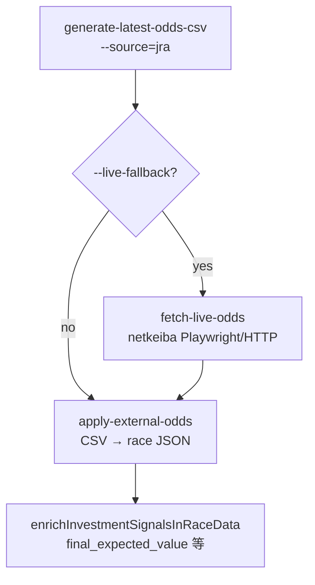
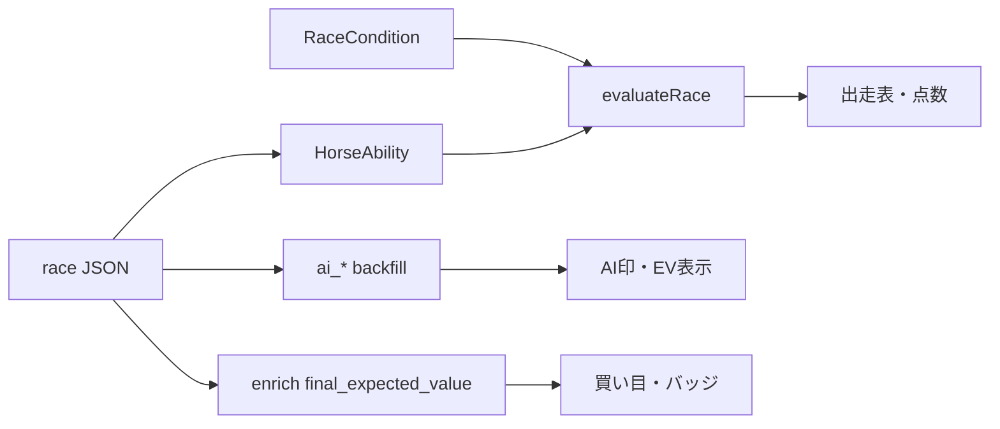

# 現状実装まとめ（2026年5月時点）

本ドキュメントは、**いまリポジトリに入っている実装・運用手順**を一枚にまとめたものです。  
詳細な評価式・画面対応表は従来ドキュメントを参照してください。

| ドキュメント | 内容 |
|--------------|------|
| [実装内容まとめ.md](./実装内容まとめ.md) | 点数・`evaluateRace`・enrich（`final_expected_value`） |
| [scraping-architecture.md](./scraping-architecture.md) | netkeiba / JRA 取得の技術詳細 |
| [実装ロジック詳細一覧.md](./実装ロジック詳細一覧.md) | AI印・買い目・バックテストの網羅 |
| [jra-odds-setup.md](./jra-odds-setup.md) | JRA API 環境変数 |
| [馬券的中ロジックまとめ.md](./馬券的中ロジックまとめ.md) | 的中・払戻判定 |

---

## 1. システム概要

| 層 | 技術 | 役割 |
|----|------|------|
| UI | Vite + React + TypeScript | レース一覧・詳細、AI印、買い目、期待値表示 |
| レースデータ | `src/data/races/{raceId}.json` | 出走・過去走・市場オッズ・AI/enrich フィールド |
| 評価（ブラウザ） | `evaluateRace` + パイプライン | 能力スコア・100点換算・条件適性 |
| 投資シグナル（Node） | `enrich-investment-signals.mjs` | `predicted_win_rate` / `final_expected_value`（能力 softmax 系） |
| 投資シグナル（Python） | `backfill-ai-predictions.py` | `ai_predicted_win_rate` / `ai_effective_ev`（LightGBM + isotonic） |
| オッズ | JRA 公式（Playwright）+ netkeiba 補完 | `refresh-latest-odds.mjs` が標準入口 |

---

## 2. 予想・期待値の二系統（混同しないこと）

### 2.1 Node enrich（TS 系・画面の「補正スコア」列など）

| 項目 | 内容 |
|------|------|
| スクリプト | `scripts/enrich-investment-signals.mjs` |
| 勝率 | `abilityScorer.mjs` → `predicted_win_rate`（レース内 softmax、**オッズ更新だけでは再計算しない**既定） |
| 期待値 | `final_expected_value = predicted_win_rate × 単勝オッズ − ev_margin_dynamic` |
| 動的マージン | 約 0.08〜0.30（頭数・重賞・新馬等） |
| UI | 買い目タブ「補正スコア」、`FinalExpectedRecommendBadge`（閾値 **1.2**） |

### 2.2 Python AI バックフィル（AI タブ・印・EV 推奨）

| 項目 | 内容 |
|------|------|
| スクリプト | `scripts/backfill-ai-predictions.py` |
| モデル | `python/models/lgbm_model.pkl` + `python/models/betting_evaluator.pkl`（isotonic キャリブレーション） |
| 勝率 | `ai_predicted_win_rate` … 生スコア → isotonic → **レース内合計 1.0 に正規化** |
| 期待値 | `ai_effective_ev = ai_predicted_win_rate × min(単勝, 100) − 0.15` |
| UI 印 | `src/lib/pipeline/aiMarkAssignment.ts`（方針B） |
| 買い目 EV | `src/domain/betting/bettingRules.ts`（閾値 **1.3** 等、`investmentEvConstants.ts`） |

**運用上**: オッズを更新したあと **AI 表示を最新にするなら backfill 必須**。enrich だけでは `ai_*` は変わりません。

---

## 3. オッズ更新（標準運用）

### 3.1 推奨コマンド（JRA 公式デフォルト）

```bash
# 1) オッズ取得・反映（30〜60分程度。Ctrl+C しない）
node scripts/refresh-latest-odds.mjs --date=YYYY-MM-DD --live-fallback --retries=3 --retry-wait=30000

# 2) AI 勝率・EV を最新オッズで再計算
python3 scripts/backfill-ai-predictions.py --start-date YYYY-MM-DD --end-date YYYY-MM-DD --ts-only
```

1行:

```bash
node scripts/refresh-latest-odds.mjs --date=YYYY-MM-DD --live-fallback --retries=3 --retry-wait=30000 \
  && python3 scripts/backfill-ai-predictions.py --start-date YYYY-MM-DD --end-date YYYY-MM-DD --ts-only
```

| 注意 | 内容 |
|------|------|
| **`--source=netkeiba` を付けない** | 付けると JRA 公式ルートを使わず CSV が空になりやすい |
| デフォルト | `--source=jra`（`package.json` の `refresh-latest-odds` も同様） |
| `--live-fallback` | JRA CSV 後に `fetch-live-odds` でレース JSON を直接更新 |

### 3.2 `refresh-latest-odds.mjs` の内部順序



| 段階 | 出力例 |
|------|--------|
| JRA CSV | `done. races=36, rows=551, jra_rows=551, jra_miss_races=0` |
| live-fallback | `round 1/3: changed=36, fetched=549` |
| 完了 | `attempt=1 summary: ...` |

### 3.3 JRA 取得（`scripts/lib/jraDriver.mjs`）

- Playwright で **sp.jra.jp** から単勝・枠・人気を取得
- `resolveRaceNavigationContext`（`raceIdResolver.mjs`）で場・R・日付を解決
- 注目レース（11R 等）直リンク → 場名クリック → `NR` 形式のドリルダウン
- 失敗時: `jra_miss_races` 増加、`--source=auto` 時は netkeiba フォールバック（`--source=jra` 単体では netkeiba に落ちない）

### 3.4 保存フィールド（エントリ）

| フィールド | 意味 |
|------------|------|
| `market_win_odds` | 単勝オッズ（表示・EV 用） |
| `market_win_odds_source` | `actual` / `estimated` |
| `market_popularity` / `market_popularity_source` | 人気 |
| `market_observed_at` | 取得時刻（ISO） |

---

## 4. AI 印（方針B）

実装: `src/lib/pipeline/aiMarkAssignment.ts`

| ルール | 内容 |
|--------|------|
| ソート | `ai_effective_ev` 降順 → 同率時 `ai_predicted_win_rate` → `finalEvaluationScore` |
| ◎ | **勝率 8% 以上**（`ANCHOR_MIN_PREDICTED_WIN_RATE`）のうち EV 最上位。該当なしなら EV1位に ◎ |
| ○▲☆△ | EV 順に最大 7 スロット（`AI_MARK_SLOTS`） |
| G1 | EV + `finalEvaluationScore/100 × 0.1` のハイブリッド順位 |
| 前提 | 全頭に `ai_predicted_win_rate` / `ai_effective_ev` あり（`raceHasFullAiBackfill`）。欠損時は TS 印 |

### 4.1 期待値レース（UI ラベル）

- レース内最高 `ai_effective_ev` が **`AI_EFFECTIVE_EV_THRESHOLD`（1.30）** 以上のとき「期待値レース」扱い（当週 TOP5 等）
- 実装: `src/domain/race-evaluation/weeklyTopEvRaces.ts`、`investmentEvConstants.ts`

---

## 5. 既知の挙動・制約

### 5.1 `ai_effective_ev = -0.15` が多い理由

| 原因 | 説明 |
|------|------|
| 式 | `EV = P × O − 0.15`。**P = 0** のとき常に **-0.15**（床、`AI_EV_FLOOR`） |
| キャリブレーション | isotonic 後の正規化で **確率が上位少数頭に集中**し、下位は **勝率 0%** になりやすい |
| 印 | EV 順で 7 枠を埋めるため、**勝率 0% でも △ が付く**ことがある（EV も -0.15） |

**2026-05 試行**: 各馬に min_prob 0.5% を足す案A + 印除外の案C を実装したが、予想精度の印象が悪化したため **リバート済み**（案B・キャリブレーター再学習は未実施）。

### 5.2 netkeiba の `---.-`

発売前はオッズ HTML が未数値 → パース 0 行。**`--source=netkeiba` のみ**だと `rows=0` になりやすい。

### 5.3 所要時間

- JRA 36R: おおよそ **15〜40 分**
- `--live-fallback`: さらに **15〜30 分**
- backfill 36R: 数分

---

## 6. 画面・データフロー（要約）



| 画面 | 主な数値ソース |
|------|----------------|
| 出走表・点数 | `adjustedScore` → 100 点換算 |
| AI 予想タブ | 同上 + `ai_*`（バックフィル済み時） |
| 買い目 | `final_expected_value`（enrich）+ `generateBetTicketsFromEvaluation`（AI EV） |
| 当週期待値 TOP5 | `ai_effective_ev` 最大馬 |

---

## 7. コマンド早見表

| 目的 | コマンド |
|------|----------|
| 開発サーバー | `npm run dev` → http://localhost:5173/ |
| 出馬表取得 | `node scripts/fetch-races-from-netkeiba.mjs --date=YYYY-MM-DD` |
| **オッズ更新（推奨）** | 上記 §3.1 |
| enrich のみ | `npm run enrich-investment-signals` |
| AI バックフィル | `python3 scripts/backfill-ai-predictions.py` |
| キャリブレーション監査 | `npm run python:diagnose-calibration` |
| 品質ゲート | `npm run python:quality-gate` |
| 過去走のみ | `npm run fetch-past-runs` |
| 結果取得 | `npm run fetch-results` |

---

## 8. 主要ファイル索引

| 領域 | パス |
|------|------|
| オッズ統合 | `scripts/refresh-latest-odds.mjs` |
| JRA Playwright | `scripts/lib/jraDriver.mjs`, `scripts/lib/raceIdResolver.mjs` |
| netkeiba HTTP | `scripts/lib/netkeibaFetch.mjs` |
| ライブオッズ | `scripts/fetch-live-odds.mjs` |
| CSV 生成 | `scripts/generate-latest-odds-csv.mjs` |
| CSV 反映 | `scripts/apply-external-odds.mjs` |
| AI バックフィル | `scripts/backfill-ai-predictions.py`, `python/betting_evaluator.py` |
| AI 印 | `src/lib/pipeline/aiMarkAssignment.ts` |
| EV 閾値 | `src/domain/race-evaluation/investmentEvConstants.ts` |
| 買い目ルール | `src/domain/betting/bettingRules.ts` |
| 評価コア | `src/domain/race-evaluation/scoreCalculator.ts` |
| enrich | `scripts/lib/investmentSignals.mjs` |

---

## 9. 変更履歴メモ（ドキュメント用）

| 日付 | 内容 |
|------|------|
| 2026-05 | JRA 公式オッズをデフォルトに。`refresh-latest-odds` + `live-fallback` + `backfill` の運用確立 |
| 2026-05 | min_prob 案A/C 試行 → リバート（現状は isotonic + 方針B 印のまま） |

---

*ロジック・運用変更時は本ファイルと `scraping-architecture.md` §6 を同時に更新してください。*
